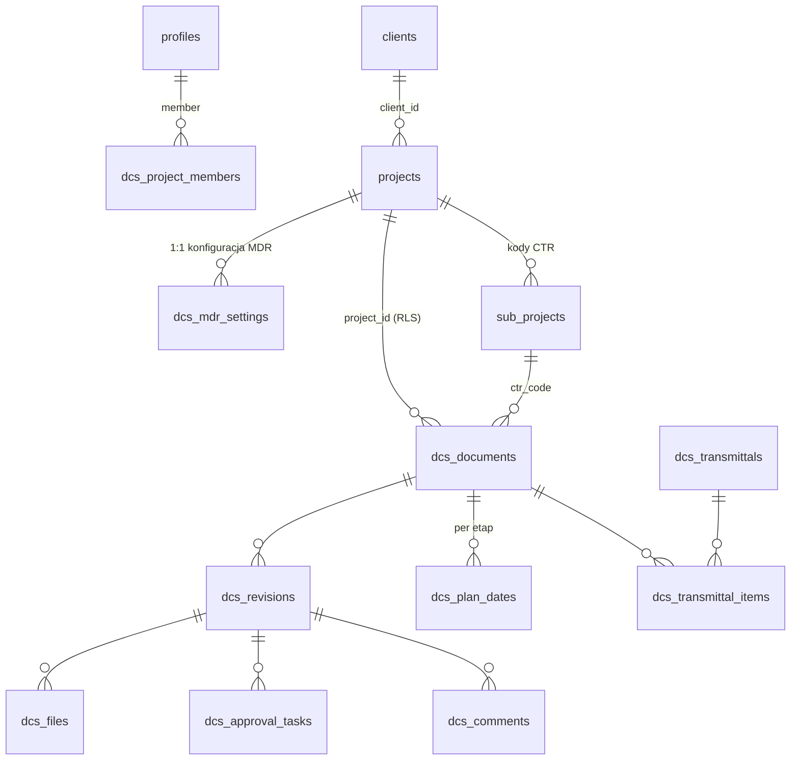

# Model danych DCS

Pojęcia: [00-glossary.md](00-glossary.md). Punkty otwarte:
[04-open-questions.md](04-open-questions.md).

**Legenda stanu:**
- ✅ POTWIERDZONE — tabela istnieje na prod (zweryfikowane odczytem MCP 2026-08-31).
- 📐 PROJEKT — wynika z briefu; nie ma jeszcze migracji, szczegóły mogą się
  zmienić w Fazie 0/1a.
- ⚠️ WYMAGA DECYZJI — zależy od nierozstrzygniętego punktu otwartego.

## ERD

## Tabele core (dziedziczone przez DCS)

### ✅ `public.profiles` (+ `auth.users`)
`id (uuid, FK auth.users)`, `full_name`, `role user_role
(admin | employee | project_lead)`, `employee_id`, `position`, stawki.
RLS: użytkownik czyta siebie, admin wszystko.
Rozstrzygnięte ([ADR-0006](adr/0006-role-dcs-per-projekt.md)): enum
`user_role` należy do TES i nie rośnie o role DCS; role DCS wyłącznie
w `dcs.project_members`; `project_lead` nie jest mapowany na żadną rolę
DCS; administrator DCS = `role = 'admin'`.

### ✅ `public.projects`
`id`, `name`, `description`, `is_active`, `project_code (unique, NOT NULL)`.
`project_code` to pierwszy człon numeru dokumentu DCS, więc od migracji
`20260901082600_enforce_project_code_format` ma `CHECK (^SC\d{4}$ OR ^SCMS OR
= 'SCC005')`. `IT admin` dostał kod `SCMS-IT` (był pusty). Jedyne odstępstwo
`SCC005` (ISO Certyfikacja) to wyjątek **imienny**, nie wzorzec — patrz O-11
i `docs/deferred-tasks.md`.
`client_id (uuid, nullable, FK clients, ON DELETE RESTRICT)` — od migracji
`20260901123548_add_clients_table`; NULL = projekt wewnętrzny (patrz
`public.clients` niżej).
`process_type (enum project_process_type: internal|tender|project|course,
nullable)` i `year (int, nullable)` — od migracji `20260902114743`
(rozstrzygnięcie O-13): to tożsamość projektu wspólna dla modułów, więc
mieszka w `projects`; konfiguracja specyficzna dla DCS w `dcs.mdr_settings`
(patrz niżej). Backfill objął wyłącznie pewny przypadek: kody `^SCMS` →
`internal`; kody SCYYNN (i imienny `SCC005`) zostały NULL — czy to Project
czy Tender wie tylko DC, migracja nie zgaduje. `status` MDR celowo NIE trafił
do `projects`: TES ma `is_active` (czy wolno logować godziny), a status MDR
to inne pojęcie (dokumentacja otwarta/zamknięta) — leży w `mdr_settings`.
RLS: odczyt dla zalogowanych, zapis dla admina. Uwaga: odczyt NIE jest
ograniczony per użytkownik — jedyna polityka SELECT (`Widoczność projektów`)
przepuszcza każdego zalogowanego, więc wszyscy widzą wszystkie projekty
(zweryfikowane odczytem prod 2026-08-31). Jeśli członek projektu DCS ma
widzieć wyłącznie swoje projekty, wymaga to NOWEJ polityki (Faza 1a, razem
z `dcs.project_members`) — odziedziczona tego nie daje.

### ✅ `public.sub_projects` = kody CTR
`id`, `project_id (FK)`, `code`, `description`, `is_active`, `is_deleted`,
`tracking_type`. Dokument DCS wybiera CTR z listy swojego projektu
(`dcs.documents.ctr_code → sub_projects.id`).
⚠️ WYMAGA DECYZJI (O-06): jeśli kody CTR mają być wspólne firmowo, a nie per
projekt, FK traci warunek „z listy projektu”, a słownik przestaje wisieć pod
`project_id` — zmienia to też walidację w kreatorze Create Project MDR.

### ✅ `public.clients`
`id`, `name (not null, niepusty)`, `code (unique, not null, `^[A-Z0-9]{2,10}$`)`,
`contact_email`, `notes`, `is_active (default true)`, `created_at`.
Utworzona migracją `20260901123548_add_clients_table` (DCS 1a.04). Format
kodu bez separatorów, bo `code` staje się członem numeru dokumentu w numeracji
CPY (§6.3) rozdzielanego myślnikami — myślnik w kodzie uniemożliwiłby
parsowanie numeru. `projects.client_id` — FK nullable (NULL = projekt
wewnętrzny, `process_type = Internal`), **ON DELETE RESTRICT**: klienta
z projektami się nie usuwa (SET NULL po cichu przemianowałoby jego projekty
na wewnętrzne), tylko dezaktywuje (`is_active = false`).
RLS: SELECT dla każdego zalogowanego, INSERT/UPDATE/DELETE wyłącznie admin
(`is_admin()`) — ten sam model co `public.projects`. Świadome odstępstwo od
pierwotnego zakresu zadania („SELECT dla członków projektów tego klienta"):
`dcs.project_members` jeszcze nie istnieje (1a.06), a oparcie polityki na
`project_assignments` z TES oznaczałoby przepisanie jej dwa zadania później.
Ewentualne zawężenie widoczności — razem z 1a.06, tym samym ruchem co dla
`projects` (patrz uwaga wyżej). Test: `supabase/tests/rls_clients.test.sql`.

### 📐 `public.audit_log`
Wspólny dla modułów (brief §5.9): `user_id`, `ts`, `table_name`, `record_id`,
`field`, `old_value`, `new_value`, `ip`. Zapis wyłącznie triggerami /
funkcjami `security definer`; RLS: odczyt admin + DC, brak update/delete dla
kogokolwiek. Retencja — punkt otwarty O-04.

Tabele TES (`timesheet_*`, `expense_*`, `earnings_*`, `pdf_exports`,
`weekly_contract_codes`, `*_assignments`) nie są dziedziczone przez DCS —
DCS ich nie czyta i nie modyfikuje.

## Tabele `dcs.*`

Schemat `dcs` istnieje od migracji `20260902114742` ([ADR-0003](adr/0003-osobny-schemat-dcs.md)):
granty `usage` + default privileges wyłącznie dla `authenticated`
i `service_role` — **bez anon i bez PUBLIC**, spójnie z `public` po migracji
`20260831143841`. Schemat jest dopisany do `[api].schemas` w `config.toml`
(PostgREST + `gen types`).

Reguła nienegocjowalna: każda tabela `dcs.*` ma `project_id` + RLS + polityki
+ test pgTAP w tym samym PR (patrz `CLAUDE.md`). Tam, gdzie `project_id` nie
jest kluczem naturalnym (np. `files`), jest denormalizowany właśnie pod RLS.
Poza `mdr_settings` całość poniżej to 📐 PROJEKT.

### ✅ `dcs.mdr_settings` (1:1 z `projects`)
`project_id (PK/FK → projects, ON DELETE CASCADE)`, `cpy_numbering bool
(default false)`, `cycle_idc_to_ifr int (=7)`, `cycle_ifr_to_retcom int
(=10)`, `cycle_retcom_to_ifc int (=7)` — wszystkie trzy `CHECK > 0`,
`budget_hours numeric (nullable, CHECK >= 0)`, `status (enum dcs.mdr_status:
active|closed, default active)`, `created_at`, `updated_at` (trigger
`set_updated_at`). Utworzona migracją `20260902114744` (DCS 1a.05).
Semantyka istnienia wiersza: **brak wiersza = DCS nie prowadzi tego
projektu** — wierszy nie tworzy się hurtem dla istniejących projektów;
wiersz powstaje przy zakładaniu MDR w DCS (kreator, 1a.17). ON DELETE
CASCADE: ustawienia bez projektu to bezsensowna sierota, a kasowanie
projektów i tak jest w TES admin-only. Częstotliwość podsumowania e-mail
(brief §5.2) — dojdzie z modułem powiadomień, nie teraz.
RLS: SELECT dla każdego zalogowanego, zapis wyłącznie admin (`is_admin()`) —
docelowo zapis DC (rozszerzenie polityk razem z `project_members`,
1a.06/1a.09). Test: `supabase/tests/rls_mdr_settings.test.sql`.

### `dcs.project_members`
`project_id`, `user_id (FK profiles)`, `dcs_role
(orig|rev|chk|app|dc|viewer)`, `active`. Jedyne źródło ról DCS
([ADR-0006](adr/0006-role-dcs-per-projekt.md)) — mówi, kto **może** pełnić
rolę w projekcie: źródło listy recenzentów IDC, walidacja obsady
`documents`/`approval_tasks` i podstawa polityk RLS pozostałych tabel
(globalny `user_role` uczestniczy tylko przez `is_admin()`). Ograniczenie: Originator dokumentu
≠ Checker tej samej rewizji (egzekwowane w bazie).
RLS: odczyt członkowie projektu, zapis DC/admin.

### `dcs.documents`
`id`, `project_id (FK, RLS)`, `scl_doc_number (unique globalnie, generowany,
niezmienny)`, `cpy_doc_number (nullable, unique per projekt, edytuje tylko
DC)`, `title`, `doc_type (FK słownik)`, `discipline (FK)`, `area (FK)`,
`language (EN|PL)`, `originator_id`, `checker_id`, `approver_id`
(FK profiles), `ctr_code (FK sub_projects)`, `budget_hours` (default z typu
dokumentu, załącznik A briefu), `workflow_status (not_started|started|idc|ifr|
retcom|ifc|ifi|ifb|void)`, `current_revision_id (FK revisions)`.
`originator_id/checker_id/approver_id` to **domyślna obsada dokumentu**
(z MDR), nie źródło prawdy dla obiegu — przy tworzeniu rewizji kopiowana
do `approval_tasks` (patrz tam); zmiana na dokumencie działa tylko na
przyszłe rewizje. Każda z tych osób musi być aktywnym członkiem
`project_members` z odpowiednią rolą (walidacja w bazie).
Numer SCL: `PROJEKT-ORIG-TYPE-SEQ-LANG` (np. `SC2601-SCL-RA-0012-EN`);
SEQ atomowo per PROJEKT+TYPE, luki niewypełniane, ręczny wpis niemożliwy.
RLS: odczyt członkowie projektu; insert/update wg roli (ORIG tworzy, DC
zmienia numery i status).
⚠️ WYMAGA DECYZJI (O-05): mapowanie kolorów z kolumny E arkusza SMDR na
`workflow_status` — blokuje import (M14) i definicję kolorów w widoku MDR.

### `dcs.revisions`
`id`, `document_id (FK)`, `project_id`, `scl_revision (walidowana:
A,B,…/00,01,…/1,2,…)`, `cpy_revision (dowolny format)`, `step (idc|ifr|
retcom|ifc|ifi|ifb)`, `reason_for_issue`, `revision_date`,
`acceptance_code (1–4, nullable)`, `status (draft|in_review|approved|
rejected|superseded|void)`, `created_by`. `step` używa wspólnego enuma
`dcs.step` — patrz `plan_dates`.
Rewizje finalne (IFC/IFI/IFB): niemodyfikowalność plików i rekordu
egzekwowana **triggerem w bazie**, nie we frontendzie.
RLS: jak `documents`.

### `dcs.files`
`id`, `revision_id (FK)`, `project_id`, `file_name` (generowana:
`[SCL_DOC_NUMBER]_[REV]_[STEP]_[YYYY-MM-DD]_[NN].[ext]`), `original_name`,
`storage_path`, `file_kind (original|rendition|attachment|comment_sheet)`,
`sort_order`, `size_bytes`, `mime_type`, `uploaded_by`, `uploaded_at`.
Pliki w Supabase Storage, dostęp tylko przez signed URL.
RLS (tabela + storage policies): odczyt członkowie projektu, zapis ORIG/DC;
blokada zapisu dla rewizji finalnych.

### `dcs.approval_tasks`
Jeden silnik dla obu trybów obiegu: `id`, `revision_id (FK)`, `project_id`,
`assignee_id (zawsze osoba, nie rola)`, `role (reviewer|checker|approver|
doc_controller)`, `mode (parallel|sequential)`, `sequence int`,
`acceptance_code (1–4)`, `comment (wymagany przy kodzie 3)`,
`status (pending|completed|cancelled)`, `assigned_at`, `completed_at`.
parallel: etap kończy się, gdy wszystkie zadania `sequence=1` Completed;
sequential: `n+1` staje się Pending po zaliczeniu `n`; kod 3 anuluje
pozostałe Pending. Recenzent z wystawionym kodem nieusuwalny.
Źródła prawdy obsady: `project_members` = kto **może** (pula + RLS);
`documents.*_id` = domyślna obsada kopiowana tu przy utworzeniu rewizji;
po skopiowaniu `assignee_id` jest źródłem prawdy dla tej rewizji —
zmiany składu (DC/ORIG wg §7.2.1) edytują zadania, nie dokument.
RLS: assignee widzi i wypełnia swoje zadanie; oceny innych niewidoczne do
zamknięcia etapu; DC/ORIG zarządzają składem wg reguł §7.2.1.

### `dcs.plan_dates`
`id`, `document_id (FK)`, `project_id`, `step`, `planned` (z cyklu MDR,
nadpisywalne przez DC), `planned_overridden bool`
(blokuje automatyczne przeliczenie), `forecast` (edytuje ORIG), `actual`
(zapisuje wyłącznie system przy zamknięciu etapu — bez uprawnienia update
dla ról). Reguły przeliczania: brief §8.3.
Kroki: jeden enum `dcs.step (start|idc|ifr|retcom|ifc|ifi|ifb)` wspólny
z `revisions`; różnice zakresu egzekwują CHECK-i, nie osobne enumy —
`plan_dates` tylko kroki planowalne (`start…ifc`; IFI/IFB to wydania
finalne poza cyklem planowania MDR), `revisions` bez `start` (start nie
jest rewizją).
RLS: odczyt członkowie projektu; update kolumnowo wg roli.

### `dcs.comments`
`id`, `revision_id (FK)`, `project_id`, `review_id`, autor, treść, odpowiedź
Originatora, status. Podstawa generowanego arkusza komentarzy
(`…_COM.xlsx`, szablon SCMS-SCL-LA-0001-EN).
RLS: jak `approval_tasks` (widoczność po zamknięciu etapu).

### `dcs.transmittals` + `dcs.transmittal_items`
`transmittals`: `id`, `project_id`, numer transmittalu, odbiorca, data,
`created_by (DC)`. `transmittal_items`: `transmittal_id`, `revision_id`.
Przy wysyłce system ostrzega (nie blokuje) o pustym `cpy_doc_number`.
Format numeru i szablon — punkt otwarty O-07. Dane historyczne używają
formatu siedmiopolowego, importowane po rozparsowaniu (brief §13.2).
RLS: odczyt członkowie projektu, zapis DC.

### Słowniki `dcs.*`
Tabele (nie kod): `doc_types` (23 kody + budżet domyślny, załącznik A),
`disciplines`, `areas` (załącznik B), kody akceptacji, kroki. Każda pozycja
z flagą `active` (dezaktywacja ukrywa w formularzach, zachowuje historię).
Języki i statusy jako enumy Postgres. RLS: odczyt zalogowani, zapis DC/admin.
