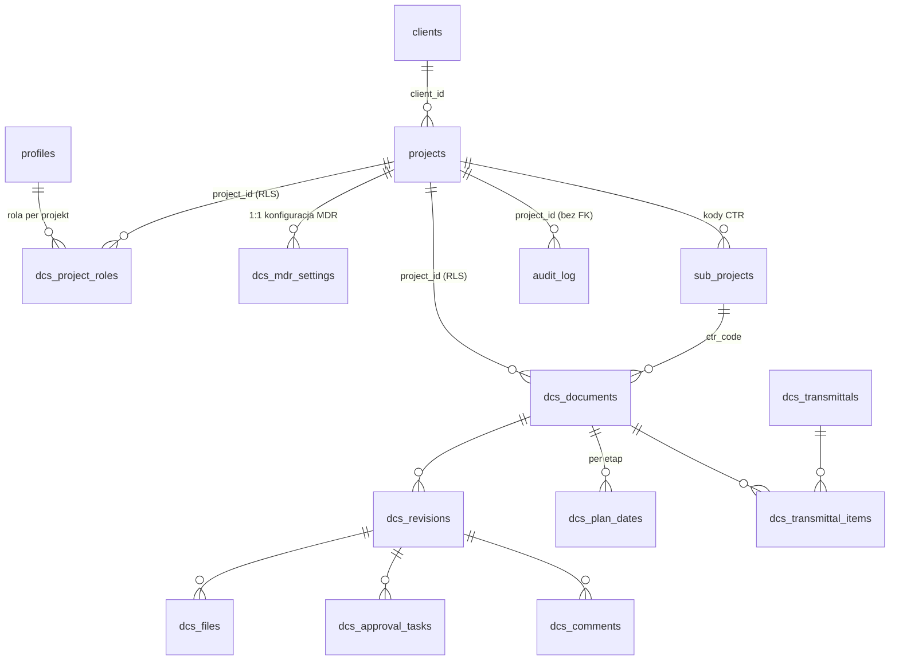

# Model danych DCS

Pojęcia: [00-glossary.md](00-glossary.md). Punkty otwarte:
[04-open-questions.md](04-open-questions.md).

**Legenda stanu:**
- ✅ POTWIERDZONE — tabela istnieje na prod (zweryfikowane odczytem MCP 2026-08-31).
- 📐 PROJEKT — wynika z briefu; nie ma jeszcze migracji, szczegóły mogą się
  zmienić w Fazie 0/1a.
- ⚠️ WYMAGA DECYZJI — zależy od nierozstrzygniętego punktu otwartego.

## ERD

## Tabele core (dziedziczone przez DCS)

### ✅ `public.profiles` (+ `auth.users`)
`id (uuid, FK auth.users)`, `full_name`, `role user_role
(admin | employee | project_lead)`, `employee_id`, `position`, stawki.
RLS: użytkownik czyta siebie, admin wszystko.
Rozstrzygnięte ([ADR-0006](adr/0006-role-dcs-per-projekt.md)): enum
`user_role` należy do TES i nie rośnie o role DCS; role DCS wyłącznie
w `dcs.project_roles` (nazwa z [ADR-0008](adr/0008-project-roles-w-schemacie-dcs.md);
ADR-0006 mówi jeszcze `project_members`); `project_lead` nie jest mapowany
na żadną rolę DCS; administrator DCS = `role = 'admin'`.

### ✅ `public.projects`
`id`, `name`, `description`, `is_active`, `project_code (unique, NOT NULL)`.
`project_code` to pierwszy człon numeru dokumentu DCS, więc od migracji
`20260901082600_enforce_project_code_format` ma `CHECK (^SC\d{4}$ OR ^SCMS OR
= 'SCC005')`. `IT admin` dostał kod `SCMS-IT` (był pusty). Jedyne odstępstwo
`SCC005` (ISO Certyfikacja) to wyjątek **imienny**, nie wzorzec — patrz O-11
i `docs/deferred-tasks.md`.
`client_id (uuid, nullable, FK clients, ON DELETE RESTRICT)` — od migracji
`20260901123548_add_clients_table`; NULL = projekt wewnętrzny (patrz
`public.clients` niżej).
`process_type (enum project_process_type: internal|tender|project|course,
nullable)` i `year (int, nullable)` — od migracji `20260902114743`
(rozstrzygnięcie O-13): to tożsamość projektu wspólna dla modułów, więc
mieszka w `projects`; konfiguracja specyficzna dla DCS w `dcs.mdr_settings`
(patrz niżej). Backfill objął wyłącznie pewny przypadek: kody `^SCMS` →
`internal`; kody SCYYNN (i imienny `SCC005`) zostały NULL — czy to Project
czy Tender wie tylko DC, migracja nie zgaduje. `status` MDR celowo NIE trafił
do `projects`: TES ma `is_active` (czy wolno logować godziny), a status MDR
to inne pojęcie (dokumentacja otwarta/zamknięta) — leży w `mdr_settings`.
RLS: odczyt dla zalogowanych, zapis dla admina. Uwaga: odczyt NIE jest
ograniczony per użytkownik — jedyna polityka SELECT (`Widoczność projektów`)
przepuszcza każdego zalogowanego, więc wszyscy widzą wszystkie projekty
(zweryfikowane odczytem prod 2026-08-31). Jeśli członek projektu DCS ma
widzieć wyłącznie swoje projekty, wymaga to NOWEJ polityki (1a.09, na bazie
`dcs.project_roles` i `has_project_role()`) — odziedziczona tego nie daje.

### ✅ `public.sub_projects` = kody CTR
`id`, `project_id (FK)`, `code`, `description`, `is_active`, `is_deleted`,
`tracking_type`. Dokument DCS wybiera CTR z listy swojego projektu
(`dcs.documents.ctr_code → sub_projects.id`).
⚠️ WYMAGA DECYZJI (O-06): jeśli kody CTR mają być wspólne firmowo, a nie per
projekt, FK traci warunek „z listy projektu”, a słownik przestaje wisieć pod
`project_id` — zmienia to też walidację w kreatorze Create Project MDR.

### ✅ `public.clients`
`id`, `name (not null, niepusty)`, `code (unique, not null, `^[A-Z0-9]{2,10}$`)`,
`contact_email`, `notes`, `is_active (default true)`, `created_at`.
Utworzona migracją `20260901123548_add_clients_table` (DCS 1a.04). Format
kodu bez separatorów, bo `code` staje się członem numeru dokumentu w numeracji
CPY (§6.3) rozdzielanego myślnikami — myślnik w kodzie uniemożliwiłby
parsowanie numeru. `projects.client_id` — FK nullable (NULL = projekt
wewnętrzny, `process_type = Internal`), **ON DELETE RESTRICT**: klienta
z projektami się nie usuwa (SET NULL po cichu przemianowałoby jego projekty
na wewnętrzne), tylko dezaktywuje (`is_active = false`).
RLS (stan 1a.09, migracja `20260903184934`): SELECT — admin lub członek
dowolnego projektu z `client_id` tego klienta (podzapytanie po
`public.projects` + `is_project_member(p.id)`, patrz „Funkcje pomocnicze
RLS” niżej); INSERT/UPDATE/DELETE — wyłącznie admin (`Admins manage
clients`). Historia: 1a.04 dało SELECT każdemu zalogowanemu, bo tabeli ról
jeszcze nie było; 1a.09 zawęziło.
**Świadoma decyzja (1a.09, 2026-09-04): INSERT/UPDATE/DELETE na `clients`
zostaje admin-only, mimo że zakres zadania mówił „admin/DC”.** Powód:
klient może obejmować kilka projektów, a DC jest rolą per projekt — „który
DC może edytować klienta” jest niedookreślone, dopóki Faza 4 nie rozstrzygnie
relacji klient–projekt. To wybór, nie przeoczenie: test
`rls_clients.test.sql` i `rls_project_role_functions.test.sql` utrwalają
odmowę zapisu dla DC jako przypadek **czerwony** („clients RED: DC of PEJ
cannot insert a client” / „update … has no effect”). Rozszerzenie zapisu na
DC — razem z ekranem klientów, zadanie 1a.16. TES nie czyta `clients` ani
`client_id` (grep `apps/` 2026-09-04, zero trafień poza artefaktami
`.next/`), więc zawężenie SELECT nie dotyka Timesheetu. Testy:
`supabase/tests/rls_clients.test.sql`,
`supabase/tests/rls_project_role_functions.test.sql`.

### ✅ `public.module_permissions`
`id uuid PK`, `user_id (uuid, FK → profiles, ON DELETE CASCADE)`, `module
(enum public.portal_module: tes|dcs|bms)`, `granted_at (default now())`.
UNIQUE `(user_id, module)`. Utworzona migracją `20260904170000` (DCS 1a.22,
[ADR-0009](adr/0009-module-permissions-per-uzytkownik.md)) — Client plan item
1a.03: nie każdy użytkownik TES ma trafiać do DCS. Kształt: wiersz =
przyznanie (obecność, nie kolumna `bool`) — brak wiersza = brak dostępu.
Żyje w `public`, nie `dcs` ([ADR-0009](adr/0009-module-permissions-per-uzytkownik.md)):
to warstwa wspólna dla wszystkich modułów, symetrycznie do `profiles`, nie
DCS-specyficzna jak `dcs.project_roles`. Bez `project_id` — dostęp do modułu
jest globalny dla konta, nie per projekt; wpis uzasadniający jak
`dcs.dictionaries` (1a.07).
Domyślne przyznanie: trigger `grant_default_module_access()` (`AFTER INSERT
ON public.profiles`) daje TES każdemu nowemu kontu; DCS i BMS wymagają
akcji administratora. Migracja backfilluje istniejące konta raz przy
wdrożeniu: TES wszystkim, DCS kontom z `profiles.role = 'admin'`
(zweryfikowane na prod 2026-09-04: 15 profili, 2 admin), BMS nikomu.
RLS: SELECT — właściciel wiersza (`auth.uid() = user_id`); zapis (ALL) —
wyłącznie admin (`is_admin()`). Audytowana przez `audit_trigger()` (1a.08) —
`project_id` w logu `NULL`, jak dla `profiles`/`clients`.
**Świadomie NIE konsumowana jeszcze przez żaden gate** ([ADR-0009](adr/0009-module-permissions-per-uzytkownik.md)):
`proxy.ts` (oba apps) i `apps/timesheet/app/admin/layout.tsx` pozostają
nietknięte — to osobne zadanie, tak samo jak rozbieżność DC-bez-admina
znaleziona w 1a.11, której ta tabela jest docelowym domem. Ekran
administracyjny: karta "Module Access" w
`apps/timesheet/app/admin/users/[id]` (checkbox per moduł, wzorzec
identyczny z kartą dostępu do projektów). Test:
`supabase/tests/rls_module_permissions.test.sql`.

### ✅ `public.audit_log`
Wspólny dla modułów (brief §5.9, §3.5). Utworzona migracją
`20260903173128_create_audit_log` (DCS 1a.08). Kolumny (stan faktyczny):
`id uuid PK`, `occurred_at timestamptz (default now())`, `user_id uuid
(nullable, bez FK — ślad ma przeżyć konto; NULL = zapis bez sesji: seed,
migracja, psql)`, `table_name text (schemat-kwalifikowana nazwa źródła:
`public.projects`, `dcs.project_roles` — trigger obsługuje dwa schematy)`,
`record_id uuid`, `action text CHECK (INSERT|UPDATE|DELETE)`, `field_name
text (NULL dla INSERT/DELETE; nazwa jednej zmienionej kolumny dla UPDATE)`,
`old_value jsonb`, `new_value jsonb`, `ip text (pierwszy adres z nagłówka
`x-forwarded-for` w `request.headers` PostgREST-a; NULL poza tym
kontekstem)`, `project_id uuid (nullable, bez FK — ślad ma przeżyć
usunięcie projektu)`. Indeksy: `(table_name, record_id, occurred_at)`
i `(project_id, occurred_at)`.
Semantyka `project_id` (decyzja 1a.08): dla `public.projects` = własne `id`
wiersza; dla tabel z kolumną `project_id` (`dcs.project_roles`) = ta kolumna;
dla tabel bez naturalnego zakresu projektowego (`public.profiles`,
`public.clients`) = NULL. To podstawa przyszłej polityki „DC widzi wpisy
swoich projektów”.
Mechanizm: jedna generyczna funkcja `public.audit_trigger()` (`security
definer`, `search_path = ''`, AFTER INSERT/UPDATE/DELETE FOR EACH ROW).
INSERT/DELETE = jeden wiersz z całym rekordem w `new_value`/`old_value`;
UPDATE = **jeden wiersz na każdą faktycznie zmienioną kolumnę** (`IS
DISTINCT FROM` na jsonb; `updated_at` pomijane; JSON `null` zapisywane jako
SQL NULL). UPDATE bez zmiany wartości nie zapisuje nic. Jedyne założenie
strukturalne: PK `id uuid` (tabela z innym PK, np. `mdr_settings`, wymaga
osobnej gałęzi w funkcji). Funkcja nie ma `EXECUTE` dla ról API (trigger
odpala się bez tego uprawnienia — sprawdzane przy `CREATE TRIGGER`, nie przy
wykonaniu), więc nie powiększa lintu 0029.
Jawna lista tabel objętych triggerem: `public.projects`,
`dcs.project_roles`, `public.profiles`, `public.clients` (1a.08),
`dcs.dictionaries` (1a.07, migracja `20260904081501`),
`public.module_permissions` (1a.22, migracja `20260904170000`). Celowo NIE: `dcs.mdr_settings` (brief nie
wymienia konfiguracji MDR jako obowiązkowego zdarzenia na tym etapie — uwaga:
pola cykli `cycle_*` mieszkają właśnie tam, nie w `projects`), żadna tabela
TES (izolacja TES/DCS), przyszłe `dcs.documents`/`revisions` (Faza 1b).
Zdarzenie „pobranie pliku” loguje server action w 1b, nie trigger.
RLS: SELECT — `is_admin()` (wszystko) oraz od 1a.09 „Doc controllers read
own project audit log”: `project_id IS NOT NULL AND
is_doc_controller(project_id)` — DC widzi ślad swoich projektów, wpisy
z `project_id` NULL (`profiles`, `clients`) pozostają admin-only zgodnie
z decyzją 1a.08. **Zero** polityk INSERT/UPDATE/DELETE i dodatkowo odebrane
uprawnienia INSERT/UPDATE/DELETE/TRUNCATE rolom `authenticated`
i `service_role` (ta druga omija RLS, a TRUNCATE nie podlega RLS) — z warstwy
aplikacji nikt nie zmieni śladu; pisze wyłącznie trigger jako właściciel
tabeli. Retencja — O-04. Testy: `supabase/tests/audit_log.test.sql`,
`supabase/tests/rls_project_role_functions.test.sql`.

### ✅ Funkcje pomocnicze RLS (`public`, DCS 1a.09)
Migracja `20260903184934_add_project_role_functions_and_policies`. Wszystkie
trzy: `security definer`, `search_path = ''`, `language sql stable`,
identyfikatory w pełni kwalifikowane (przekraczają `public`/`dcs`),
`EXECUTE` dla `authenticated` (polityki wykonują się jako rola zapytania —
akceptowany lint 0029, po jednym na funkcję), bez `anon`/`PUBLIC`.
`security definer` jest tu koniecznością, nie wygodą: polityka na
`dcs.project_roles` czytająca `dcs.project_roles` pod RLS rekurowałaby
([ADR-0008](adr/0008-project-roles-w-schemacie-dcs.md)).
- `is_project_member(p_project_id uuid) → boolean` — `auth.uid()` ma wiersz
  w `public.project_assignments` (TES: loguje godziny) **lub**
  w `dcs.project_roles` (DCS: pełni rolę) dla projektu.
- `has_project_role(p_project_id uuid, p_roles dcs.project_role[]) →
  boolean` — `auth.uid()` ma w `dcs.project_roles` wiersz dla projektu
  z `role = ANY(p_roles)`.
- `is_doc_controller(p_project_id uuid) → boolean` —
  `has_project_role(p, {dc})`.
Pokrycie testowe domknięte w 1a.10 (`supabase/tests/rls_coverage_closeout.test.sql`):
`has_project_role()` z tablicami wieloelementowymi, pustą tablicą i rolą
z innego projektu; `anon` na wszystkich siedmiu tabelach z RLS z jawnym
rozróżnieniem warstw (A: brak grantów → 42501; B: statyczny kształt
polityk; C: symulowany grant SELECT w savepoincie nadal daje zero, bo
polityka admina dochodzi do `is_admin()`, do której `anon` nie ma
EXECUTE); brakujące komórki macierzy rola × tabela.
`is_admin()` reużyte bez zmian ciała. `is_pm_for_project()` (TES) nie zna
ról DCS i nie jest używane przez polityki DCS. Polityka `Admin zarządza
projektami` (ALL, `is_admin()`) na `public.projects` przejrzana w 1a.09
i **pozostawiona**: kolumny, o które pytała checklista (cykle, budżet),
mieszkają w `dcs.mdr_settings`, nie tu — `projects` niesie wyłącznie
tożsamość projektu, a jej edycja jest w TES admin-only z założenia.
Test: `supabase/tests/rls_project_role_functions.test.sql`.

Tabele TES (`timesheet_*`, `expense_*`, `earnings_*`, `pdf_exports`,
`weekly_contract_codes`, `*_assignments`) nie są dziedziczone przez DCS —
DCS ich nie czyta i nie modyfikuje.

## Tabele `dcs.*`

Schemat `dcs` istnieje od migracji `20260902114742` ([ADR-0003](adr/0003-osobny-schemat-dcs.md)):
granty `usage` + default privileges wyłącznie dla `authenticated`
i `service_role` — **bez anon i bez PUBLIC**, spójnie z `public` po migracji
`20260831143841`. Schemat jest dopisany do `[api].schemas` w `config.toml`
(PostgREST + `gen types`).

Reguła nienegocjowalna: każda tabela `dcs.*` ma `project_id` + RLS + polityki
+ test pgTAP w tym samym PR (patrz `CLAUDE.md`). Tam, gdzie `project_id` nie
jest kluczem naturalnym (np. `files`), jest denormalizowany właśnie pod RLS.
Tabele bez danych projektowych (słownikowe/globalne) nie mają `project_id`
i muszą być tu jawnie opisane — dziś: `dcs.dictionaries`. Poza
`mdr_settings`, `project_roles` i `dictionaries` całość poniżej to
📐 PROJEKT.

### ✅ `dcs.mdr_settings` (1:1 z `projects`)
`project_id (PK/FK → projects, ON DELETE CASCADE)`, `cpy_numbering bool
(default false)`, `cycle_idc_to_ifr int (=7)`, `cycle_ifr_to_retcom int
(=10)`, `cycle_retcom_to_ifc int (=7)` — wszystkie trzy `CHECK > 0`,
`budget_hours numeric (nullable, CHECK >= 0)`, `status (enum dcs.mdr_status:
active|closed, default active)`, `created_at`, `updated_at` (trigger
`set_updated_at`). Utworzona migracją `20260902114744` (DCS 1a.05).
Semantyka istnienia wiersza: **brak wiersza = DCS nie prowadzi tego
projektu** — wierszy nie tworzy się hurtem dla istniejących projektów;
wiersz powstaje przy zakładaniu MDR w DCS (kreator, 1a.17). ON DELETE
CASCADE: ustawienia bez projektu to bezsensowna sierota, a kasowanie
projektów i tak jest w TES admin-only. Częstotliwość podsumowania e-mail
(brief §5.2) — dojdzie z modułem powiadomień, nie teraz.
RLS: SELECT dla każdego zalogowanego (bez zmian); zapis — admin
(`Admins manage mdr settings`) oraz od 1a.09 DC tego projektu (`Doc
controllers manage mdr settings`, ALL, `is_doc_controller(project_id)` —
tu właśnie stosuje się kryterium Notion „cykle/budżet: tylko admin/DC”,
bo te kolumny leżą tutaj, nie w `projects`). DC innego projektu nie ma
dostępu do zapisu. Testy: `supabase/tests/rls_mdr_settings.test.sql`,
`supabase/tests/rls_project_role_functions.test.sql`.

### ✅ `dcs.project_roles`
`id uuid PK`, `project_id (FK → projects, ON DELETE CASCADE)`, `user_id (FK
→ profiles, bez akcji kaskadowej)`, `role (enum dcs.project_role:
orig|rev|chk|app|dc|view)`, `assigned_at (default now())`, `assigned_by
(nullable FK → profiles; server action ustawia z sesji)`. UNIQUE
`(project_id, user_id, role)`; indeksy `(project_id, role)` i `(user_id)` pod
odczyty przyszłych polityk. Utworzona migracją `20260903134914` (DCS 1a.06);
schemat `dcs`, nie `public` — [ADR-0008](adr/0008-project-roles-w-schemacie-dcs.md)
(tam też zmiana nazwy z `project_members` i skutek dla QMS).
Semantyka: wiersz = **jedna rola** osoby w projekcie; ta sama osoba może mieć
kilka wierszy w jednym projekcie (np. CHK i APP) i inne role w innych
projektach. To **nie** jest `public.project_assignments` (TES: kto loguje
godziny) — obie tabele istnieją obok siebie i żadna nie zastępuje drugiej.
Globalny `profiles.role = 'admin'` = ADM z briefu, nie duplikowany tutaj.
Jedyne źródło ról DCS ([ADR-0006](adr/0006-role-dcs-per-projekt.md)) — mówi,
kto **może** pełnić rolę w projekcie: źródło listy recenzentów IDC, walidacja
obsady `documents`/`approval_tasks` i podstawa polityk RLS pozostałych tabel
(1a.09: `has_project_role()`, `is_doc_controller()`). Rozdział obowiązków
(Originator dokumentu ≠ Checker tej samej rewizji) egzekwowany w 1b na
poziomie rewizji, nie na tej tabeli. Rola `cpy` (kontakt klienta) — Faza 3.
RLS (stan 1a.09, migracja `20260903184934`): SELECT — każdy członek
projektu (`is_project_member(project_id)`: przypisanie TES **lub** rola
DCS) widzi wszystkie wiersze ról tego projektu; ALL — admin (`Admins manage
project roles`, 1a.06) oraz DC tego projektu (`Doc controllers manage
project roles`, `is_doc_controller(project_id)`), więc DC nadaje i odbiera
role w swoim projekcie bez globalnego admina. Członek bez roli DC nie
pisze; DC projektu A nie pisze w projekcie B. Historia: 1a.06 dało tylko
„własne wiersze”, bo funkcji `security definer` jeszcze nie było. Brak
kolumny `active`: odebranie roli = usunięcie wiersza (historia zmian →
`audit_log`, trigger od 1a.08). Uwaga: DC może usunąć własny wiersz `dc`
i stracić dostęp — baza tego nie blokuje (ochrona to sprawa ekranu 1a.14).
Mutacje: server actions `grantProjectRole` / `revokeProjectRole`
(`apps/dcs/app/data/actions/project-roles.ts`, logika w
`apps/dcs/lib/project-roles.ts`) — guard **admina** po stronie serwera
(`requireAdmin`), czyli akcja jest dziś węższa niż polityka: DC ma prawo
w bazie, ale akcja go odrzuci; rozszerzenie guardu na DC razem z ekranem
1a.14 (`docs/deferred-tasks.md` q). Błędy domenowe
(`role_already_granted`, `unknown_project_or_user`, `role_not_found`,
`forbidden`). Testy: `supabase/tests/rls_project_roles.test.sql`,
`supabase/tests/rls_project_role_functions.test.sql`.

### ✅ `dcs.dictionaries` (wszystkie słowniki DCS)
`id uuid PK`, `dict_type text NOT NULL` z `CHECK IN (doc_type, discipline,
area, language, acceptance_code, workflow_status, workflow_step)`, `code text`,
`label text`, `description text (nullable)`, `meta jsonb NOT NULL default
'{}'`, `sort_order int default 0`, `is_active bool default true`,
`created_at`, `updated_at` (trigger `set_updated_at`). UNIQUE `(dict_type,
code)`; indeks częściowy `(dict_type, sort_order) WHERE is_active` pod
jedyny częsty odczyt (aktywne pozycje jednego typu w kolejności).
Utworzona migracją `20260904081501` (DCS 1a.07), **pusta** — treść
z załączników A/B wgrywa 1a.18; ekran administracyjny 1a.15.
Decyzje 1a.07:
- Jedna generyczna tabela zamiast siedmiu (`doc_types`, `disciplines`, …):
  brief §5.8 wymaga edycji słowników z panelu bez deployu; jeden ekran
  z zakładkami obsługuje wszystkie typy. `meta` niesie różnice per typ
  (np. domyślny budżet godzin typu dokumentu, kolor statusu — O-05) bez
  zmian schematu.
- `dict_type` to **text + CHECK, nie enum**: lista typów będzie rosła
  w kolejnych fazach, dopisanie typu ma być zwykłą migracją, nie `ALTER
  TYPE` za bramką STOP. Konsekwencja w TS: lista `DICT_TYPES`
  w `apps/dcs/lib/dictionaries.ts` jest ręczna i musi być utrzymywana
  razem z CHECK-iem; rozjazd łapie guard CI `scripts/check-dict-types.sh`
  i przypięta lista w teście pgTAP.
- Języki (`language`) i statusy/kroki obiegu (`workflow_status`,
  `workflow_step`) są **słownikami**, nie enumami — koryguje wcześniejszy
  zapis w sekcji „Słowniki” niżej. Czy kolumny stanu przy
  `plan_dates`/`revisions` używają enuma `dcs.step`, czy FK do słownika
  `workflow_step` — punkt otwarty O-15, do rozstrzygnięcia przed 1b.
  `projects.process_type` zostaje enumem (decyzja z taska).
- **Bez `project_id`** — tabela słownikowa w rozumieniu reguły z `CLAUDE.md`
  („tabela z danymi projektowymi niesie `project_id`; globalna lub
  słownikowa wymaga wpisu tutaj”): słownik jest firmowy, kod ma jedno
  znaczenie we wszystkich projektach, a UNIQUE `(dict_type, code)` jest
  globalny.
  `audit_trigger()` obsługuje ten kształt bez zmian (`project_id` NULL,
  jak `profiles`/`clients`).
- Dezaktywacja zamiast kasowania: `is_active = false` ukrywa pozycję
  w formularzach (`getDictionary()` filtruje), baza nadal zwraca wiersz,
  więc historyczne dokumenty rozwiązują kod. Aplikacja nie kasuje wierszy;
  DELETE ma tylko admin (i tylko przez SQL/ekran, którego nie ma).
RLS (dwie polityki): SELECT — każdy zalogowany, **wszystkie wiersze łącznie
z nieaktywnymi** (`Authenticated users can read dictionaries`); ALL — admin
(`Admins manage dictionaries`, `(select is_admin())`). Zapis jest
**admin-only, nie admin-lub-DC** — świadomie, tą samą decyzją co
`clients` w 1a.09: baza nie wydaje uprawnienia, którego żaden ekran nie
używa. DC dostanie zapis razem z ekranem 1a.15; potrzebny będzie wtedy
bezprojektowy helper `is_any_doc_controller()` (nowa funkcja SECURITY
DEFINER → +1 × 0029, za bramką STOP). Test dowodzi stanu obecnego: INSERT
DC → 42501, UPDATE DC → zero wierszy.
Audyt: trigger `audit_dictionaries` = piąta tabela pod `audit_trigger()`
(`project_id` NULL, więc wpisy widzi tylko admin — DC nie ma projektu, po
którym mógłby je odczytać; do rewizji przy 1a.15).
Odczyt w aplikacji: `getDictionary(supabase, type)` w
`apps/dcs/lib/dictionaries.ts` — aktywne wiersze jednego typu w `sort_order`
(remis po `code`), typowane `Tables<{schema:'dcs'}, 'dictionaries'>`;
wzorzec jak `lib/project-roles.ts` (klient przekazywany, bez Next.js).
Test: `supabase/tests/rls_dictionaries.test.sql` (kształt, CHECK, UNIQUE,
anon/pracownik/outsider/DC/admin, wpisy w `audit_log`).

### `dcs.documents`
`id`, `project_id (FK, RLS)`, `scl_doc_number (unique globalnie, generowany,
niezmienny)`, `cpy_doc_number (nullable, unique per projekt, edytuje tylko
DC)`, `title`, `doc_type (FK słownik)`, `discipline (FK)`, `area (FK)`,
`language (EN|PL)`, `originator_id`, `checker_id`, `approver_id`
(FK profiles), `ctr_code (FK sub_projects)`, `budget_hours` (default z typu
dokumentu, załącznik A briefu), `workflow_status (not_started|started|idc|ifr|
retcom|ifc|ifi|ifb|void)`, `current_revision_id (FK revisions)`.
`originator_id/checker_id/approver_id` to **domyślna obsada dokumentu**
(z MDR), nie źródło prawdy dla obiegu — przy tworzeniu rewizji kopiowana
do `approval_tasks` (patrz tam); zmiana na dokumencie działa tylko na
przyszłe rewizje. Każda z tych osób musi mieć odpowiednią rolę
w `project_roles` dla tego projektu (walidacja w bazie).
Numer SCL: `PROJEKT-ORIG-TYPE-SEQ-LANG` (np. `SC2601-SCL-RA-0012-EN`);
SEQ atomowo per PROJEKT+TYPE, luki niewypełniane, ręczny wpis niemożliwy.
RLS: odczyt członkowie projektu; insert/update wg roli (ORIG tworzy, DC
zmienia numery i status).
⚠️ WYMAGA DECYZJI (O-05): mapowanie kolorów z kolumny E arkusza SMDR na
`workflow_status` — blokuje import (M14) i definicję kolorów w widoku MDR.

### `dcs.revisions`
`id`, `document_id (FK)`, `project_id`, `scl_revision (walidowana:
A,B,…/00,01,…/1,2,…)`, `cpy_revision (dowolny format)`, `step (idc|ifr|
retcom|ifc|ifi|ifb)`, `reason_for_issue`, `revision_date`,
`acceptance_code (1–4, nullable)`, `status (draft|in_review|approved|
rejected|superseded|void)`, `created_by`. `step` używa wspólnego enuma
`dcs.step` — patrz `plan_dates`.
Rewizje finalne (IFC/IFI/IFB): niemodyfikowalność plików i rekordu
egzekwowana **triggerem w bazie**, nie we frontendzie.
RLS: jak `documents`.

### `dcs.files`
`id`, `revision_id (FK)`, `project_id`, `file_name` (generowana:
`[SCL_DOC_NUMBER]_[REV]_[STEP]_[YYYY-MM-DD]_[NN].[ext]`), `original_name`,
`storage_path`, `file_kind (original|rendition|attachment|comment_sheet)`,
`sort_order`, `size_bytes`, `mime_type`, `uploaded_by`, `uploaded_at`.
Pliki w Supabase Storage, dostęp tylko przez signed URL.
RLS (tabela + storage policies): odczyt członkowie projektu, zapis ORIG/DC;
blokada zapisu dla rewizji finalnych.

### `dcs.approval_tasks`
Jeden silnik dla obu trybów obiegu: `id`, `revision_id (FK)`, `project_id`,
`assignee_id (zawsze osoba, nie rola)`, `role (reviewer|checker|approver|
doc_controller)`, `mode (parallel|sequential)`, `sequence int`,
`acceptance_code (1–4)`, `comment (wymagany przy kodzie 3)`,
`status (pending|completed|cancelled)`, `assigned_at`, `completed_at`.
parallel: etap kończy się, gdy wszystkie zadania `sequence=1` Completed;
sequential: `n+1` staje się Pending po zaliczeniu `n`; kod 3 anuluje
pozostałe Pending. Recenzent z wystawionym kodem nieusuwalny.
Źródła prawdy obsady: `project_roles` = kto **może** (pula + RLS);
`documents.*_id` = domyślna obsada kopiowana tu przy utworzeniu rewizji;
po skopiowaniu `assignee_id` jest źródłem prawdy dla tej rewizji —
zmiany składu (DC/ORIG wg §7.2.1) edytują zadania, nie dokument.
RLS: assignee widzi i wypełnia swoje zadanie; oceny innych niewidoczne do
zamknięcia etapu; DC/ORIG zarządzają składem wg reguł §7.2.1.

### `dcs.plan_dates`
`id`, `document_id (FK)`, `project_id`, `step`, `planned` (z cyklu MDR,
nadpisywalne przez DC), `planned_overridden bool`
(blokuje automatyczne przeliczenie), `forecast` (edytuje ORIG), `actual`
(zapisuje wyłącznie system przy zamknięciu etapu — bez uprawnienia update
dla ról). Reguły przeliczania: brief §8.3.
Kroki: jeden enum `dcs.step (start|idc|ifr|retcom|ifc|ifi|ifb)` wspólny
z `revisions`; różnice zakresu egzekwują CHECK-i, nie osobne enumy —
`plan_dates` tylko kroki planowalne (`start…ifc`; IFI/IFB to wydania
finalne poza cyklem planowania MDR), `revisions` bez `start` (start nie
jest rewizją).
RLS: odczyt członkowie projektu; update kolumnowo wg roli.

### `dcs.comments`
`id`, `revision_id (FK)`, `project_id`, `review_id`, autor, treść, odpowiedź
Originatora, status. Podstawa generowanego arkusza komentarzy
(`…_COM.xlsx`, szablon SCMS-SCL-LA-0001-EN).
RLS: jak `approval_tasks` (widoczność po zamknięciu etapu).

### `dcs.transmittals` + `dcs.transmittal_items`
`transmittals`: `id`, `project_id`, numer transmittalu, odbiorca, data,
`created_by (DC)`. `transmittal_items`: `transmittal_id`, `revision_id`.
Przy wysyłce system ostrzega (nie blokuje) o pustym `cpy_doc_number`.
Format numeru i szablon — punkt otwarty O-07. Dane historyczne używają
formatu siedmiopolowego, importowane po rozparsowaniu (brief §13.2).
RLS: odczyt członkowie projektu, zapis DC.

### Słowniki `dcs.*` — zrealizowane jako `dcs.dictionaries` (1a.07)
Pierwotny projekt zakładał osobne tabele (`doc_types` — 23 kody + budżet
domyślny z załącznika A, `disciplines`, `areas` z załącznika B, kody
akceptacji, kroki) oraz języki i statusy jako enumy Postgres. Od 1a.07
wszystkie siedem typów mieszka w jednej tabelce `dcs.dictionaries`
(sekcja ✅ wyżej), z `is_active` per pozycja i `meta` na różnice per typ;
języki i statusy/kroki obiegu też są słownikami. Zapis dziś admin-only;
DC razem z ekranem 1a.15. Treść: 1a.18.
