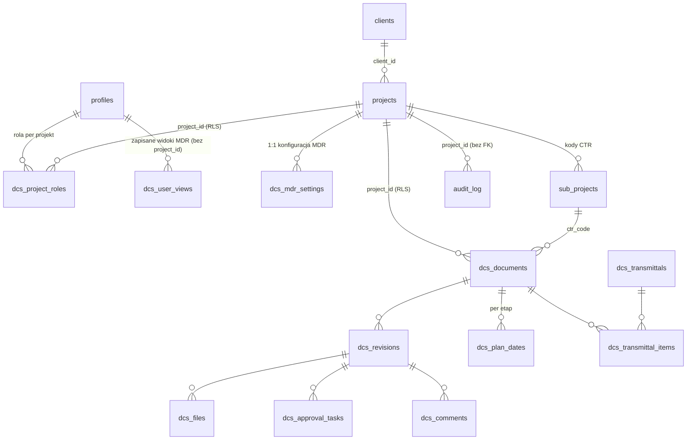

# Model danych DCS

Pojęcia: [00-glossary.md](00-glossary.md). Punkty otwarte:
[04-open-questions.md](04-open-questions.md).

**Legenda stanu:**
- ✅ POTWIERDZONE — tabela istnieje na prod (zweryfikowane odczytem MCP 2026-08-31).
- 📐 PROJEKT — wynika z briefu; nie ma jeszcze migracji, szczegóły mogą się
  zmienić w Fazie 0/1a.
- ⚠️ WYMAGA DECYZJI — zależy od nierozstrzygniętego punktu otwartego.

## ERD

## Tabele core (dziedziczone przez DCS)

### ✅ `public.profiles` (+ `auth.users`)
`id (uuid, FK auth.users)`, `full_name`, `role user_role
(admin | employee | project_lead)`, `employee_id`, `position`, stawki.
RLS: użytkownik czyta siebie, admin wszystko.
Rozstrzygnięte ([ADR-0006](adr/0006-role-dcs-per-projekt.md)): enum
`user_role` należy do TES i nie rośnie o role DCS; role DCS wyłącznie
w `dcs.project_roles` (nazwa z [ADR-0008](adr/0008-project-roles-w-schemacie-dcs.md);
ADR-0006 mówi jeszcze `project_members`); `project_lead` nie jest mapowany
na żadną rolę DCS; administrator DCS = `role = 'admin'`.

### ✅ `public.projects`
`id`, `name`, `description`, `is_active`, `project_code (unique, NOT NULL)`.
`project_code` to pierwszy człon numeru dokumentu DCS, więc od migracji
`20260901082600_enforce_project_code_format` ma `CHECK (^SC\d{4}$ OR ^SCMS OR
= 'SCC005')`. `IT admin` dostał kod `SCMS-IT` (był pusty). Jedyne odstępstwo
`SCC005` (ISO Certyfikacja) to wyjątek **imienny**, nie wzorzec — patrz O-11
i `docs/deferred-tasks.md`.
Niemodyfikowalność `project_code` egzekwuje **baza**, nie aplikacja (1a.17c,
migracja `20260915081813_project_code_immutable`): trigger `BEFORE UPDATE`
`projects_project_code_immutable` → `public.forbid_project_code_change()`
podnosi `23001` (`restrict_violation`), gdy `NEW.project_code IS DISTINCT FROM
OLD.project_code`. Bezwarunkowo — bez wyjątku dla admina i bez wyjątku dla
TES: polityka `Admin zarządza projektami` (ALL, `is_admin()`) nie patrzy,
które kolumny się zmieniły, więc bez triggera admin mógł zmienić kod przez
PostgREST, a dialog edycji projektu w `apps/timesheet` wprost to oferował.
Powód jest ten sam co przy `dcs.dictionaries.code` (1a.15b): kod siedzi już
w kodach CTR (`SC2699_CTR100`) i w historii timesheetu, a od 1b.02 jest
pierwszym członem numeru dokumentu. Poprawka błędnego kodu = nowy projekt
+ `is_active = false` na starym. TES: pole `project_code` w
`apps/timesheet/app/admin/projects/[id]/EditProjectDialog.tsx` jest odtąd
tylko do odczytu, a `updateProject` buduje payload przez
`apps/timesheet/lib/project-update.ts`, który tej kolumny nie niesie (input
`disabled` wypada z `FormData`, więc odczyt pola wysłałby `null` na kolumnę
NOT NULL). Test: `supabase/tests/project_code_immutable.test.sql` (kształt
triggera, odmowa dla postgres i dla admina, UPDATE innych kolumn i restatement
tej samej wartości przechodzą, blankowanie daje 23001 a nie 23502).
`client_id (uuid, nullable, FK clients, ON DELETE RESTRICT)` — od migracji
`20260901123548_add_clients_table`; NULL = projekt wewnętrzny (patrz
`public.clients` niżej).
`process_type (enum project_process_type: internal|tender|project|course,
nullable)` i `year (int, nullable)` — od migracji `20260902114743`
(rozstrzygnięcie O-13): to tożsamość projektu wspólna dla modułów, więc
mieszka w `projects`; konfiguracja specyficzna dla DCS w `dcs.mdr_settings`
(patrz niżej). Backfill objął wyłącznie pewny przypadek: kody `^SCMS` →
`internal`; kody SCYYNN (i imienny `SCC005`) zostały NULL — czy to Project
czy Tender wie tylko DC, migracja nie zgaduje. `status` MDR celowo NIE trafił
do `projects`: TES ma `is_active` (czy wolno logować godziny), a status MDR
to inne pojęcie (dokumentacja otwarta/zamknięta) — leży w `mdr_settings`.
RLS: odczyt dla zalogowanych, zapis dla admina. Uwaga: odczyt NIE jest
ograniczony per użytkownik — jedyna polityka SELECT (`Widoczność projektów`)
przepuszcza każdego zalogowanego, więc wszyscy widzą wszystkie projekty
(zweryfikowane odczytem prod 2026-08-31). **Rozstrzygnięte (1a.14 review,
2026-09-08; wykonane 1a.14b):** to NIE jest polityka do zawężenia — jest
odziedziczoną, produkcyjną infrastrukturą Timesheetu (każdy ekran TES, który
listuje lub wybiera projekt, zakłada, że każdy pracownik widzi każdy
projekt, niezależnie od `project_assignments`); zawężenie zepsułoby TES.
Widoczność per-DCS-rolę na `/dcs` filtruje wyłącznie `apps/dcs` po swojej
stronie (`apps/dcs/lib/project-list.ts`, na bazie własnych wierszy w
`dcs.project_roles`) — [ADR-0013](adr/0013-katalog-profili-jako-funkcja-nie-polityka.md).

### ✅ `public.sub_projects` = kody CTR
`id`, `project_id (FK)`, `code`, `description`, `is_active`, `is_deleted`,
`tracking_type`. Dokument DCS wybiera CTR z listy swojego projektu
(`dcs.documents.ctr_code → sub_projects.id`).
⚠️ WYMAGA DECYZJI (O-06): jeśli kody CTR mają być wspólne firmowo, a nie per
projekt, FK traci warunek „z listy projektu”, a słownik przestaje wisieć pod
`project_id` — zmienia to też walidację w kreatorze Create Project MDR.

### ✅ `public.clients`
`id`, `name (not null, niepusty)`, `code (unique, not null, `^[A-Z0-9]{2,10}$`)`,
`contact_email`, `notes`, `is_active (default true)`, `created_at`.
Utworzona migracją `20260901123548_add_clients_table` (DCS 1a.04). Format
kodu bez separatorów, bo `code` staje się członem numeru dokumentu w numeracji
CPY (§6.3) rozdzielanego myślnikami — myślnik w kodzie uniemożliwiłby
parsowanie numeru. `projects.client_id` — FK nullable (NULL = projekt
wewnętrzny, `process_type = Internal`), **ON DELETE RESTRICT**: klienta
z projektami się nie usuwa (SET NULL po cichu przemianowałoby jego projekty
na wewnętrzne), tylko dezaktywuje (`is_active = false`).
RLS (stan 1a.09, migracja `20260903184934`): SELECT — admin lub członek
dowolnego projektu z `client_id` tego klienta (podzapytanie po
`public.projects` + `is_project_member(p.id)`, patrz „Funkcje pomocnicze
RLS” niżej); INSERT/UPDATE/DELETE — wyłącznie admin (`Admins manage
clients`). Historia: 1a.04 dało SELECT każdemu zalogowanemu, bo tabeli ról
jeszcze nie było; 1a.09 zawęziło.
**Świadoma decyzja (1a.09, 2026-09-04): INSERT/UPDATE/DELETE na `clients`
zostaje admin-only, mimo że zakres zadania mówił „admin/DC”.** Powód:
klient może obejmować kilka projektów, a DC jest rolą per projekt — „który
DC może edytować klienta” jest niedookreślone, dopóki Faza 4 nie rozstrzygnie
relacji klient–projekt. To wybór, nie przeoczenie: test
`rls_clients.test.sql` i `rls_project_role_functions.test.sql` utrwalają
odmowę zapisu dla DC jako przypadek **czerwony** („clients RED: DC of PEJ
cannot insert a client” / „update … has no effect”). Rozszerzenie zapisu na
DC — razem z ekranem klientów, zadanie 1a.16. TES nie czyta `clients` ani
`client_id` (grep `apps/` 2026-09-04, zero trafień poza artefaktami
`.next/`), więc zawężenie SELECT nie dotyka Timesheetu. Testy:
`supabase/tests/rls_clients.test.sql`,
`supabase/tests/rls_project_role_functions.test.sql`.

### ✅ `public.module_permissions`
`id uuid PK`, `user_id (uuid, FK → profiles, ON DELETE CASCADE)`, `module
(enum public.portal_module: tes|dcs|bms)`, `granted_at (default now())`.
UNIQUE `(user_id, module)`. Utworzona migracją `20260904170000` (DCS 1a.22,
[ADR-0009](adr/0009-module-permissions-per-uzytkownik.md)) — Client plan item
1a.03: nie każdy użytkownik TES ma trafiać do DCS. Kształt: wiersz =
przyznanie (obecność, nie kolumna `bool`) — brak wiersza = brak dostępu.
Żyje w `public`, nie `dcs` ([ADR-0009](adr/0009-module-permissions-per-uzytkownik.md)):
to warstwa wspólna dla wszystkich modułów, symetrycznie do `profiles`, nie
DCS-specyficzna jak `dcs.project_roles`. Bez `project_id` — dostęp do modułu
jest globalny dla konta, nie per projekt; wpis uzasadniający jak
`dcs.dictionaries` (1a.07).
Domyślne przyznanie: trigger `grant_default_module_access()` (`AFTER INSERT
ON public.profiles`) daje TES każdemu nowemu kontu; DCS i BMS wymagają
akcji administratora. Migracja backfilluje istniejące konta raz przy
wdrożeniu: TES wszystkim, DCS kontom z `profiles.role = 'admin'`
(zweryfikowane na prod 2026-09-04: 15 profili, 2 admin), BMS nikomu.
RLS: SELECT — właściciel wiersza (`auth.uid() = user_id`); zapis (ALL) —
wyłącznie admin (`is_admin()`). Audytowana przez `audit_trigger()` (1a.08) —
`project_id` w logu `NULL`, jak dla `profiles`/`clients`.
**Świadomie NIE konsumowana jeszcze przez żaden gate** ([ADR-0009](adr/0009-module-permissions-per-uzytkownik.md)):
`proxy.ts` (oba apps) i `apps/timesheet/app/admin/layout.tsx` pozostają
nietknięte — to osobne zadanie, tak samo jak rozbieżność DC-bez-admina
znaleziona w 1a.11, której ta tabela jest docelowym domem. Ekran
administracyjny: karta "Module Access" w
`apps/timesheet/app/admin/users/[id]` (checkbox per moduł, wzorzec
identyczny z kartą dostępu do projektów). Test:
`supabase/tests/rls_module_permissions.test.sql`.

### ✅ `public.audit_log`
Wspólny dla modułów (brief §5.9, §3.5). Utworzona migracją
`20260903173128_create_audit_log` (DCS 1a.08). Kolumny (stan faktyczny):
`id uuid PK`, `occurred_at timestamptz (default now())`, `user_id uuid
(nullable, bez FK — ślad ma przeżyć konto; NULL = zapis bez sesji: seed,
migracja, psql)`, `table_name text (schemat-kwalifikowana nazwa źródła:
`public.projects`, `dcs.project_roles` — trigger obsługuje dwa schematy)`,
`record_id uuid`, `action text CHECK (INSERT|UPDATE|DELETE)`, `field_name
text (NULL dla INSERT/DELETE; nazwa jednej zmienionej kolumny dla UPDATE)`,
`old_value jsonb`, `new_value jsonb`, `ip text (pierwszy adres z nagłówka
`x-forwarded-for` w `request.headers` PostgREST-a; NULL poza tym
kontekstem)`, `project_id uuid (nullable, bez FK — ślad ma przeżyć
usunięcie projektu)`. Indeksy: `(table_name, record_id, occurred_at)`
i `(project_id, occurred_at)`.
Semantyka `project_id` (decyzja 1a.08): dla `public.projects` = własne `id`
wiersza; dla tabel z kolumną `project_id` (`dcs.project_roles`) = ta kolumna;
dla tabel bez naturalnego zakresu projektowego (`public.profiles`,
`public.clients`) = NULL. To podstawa przyszłej polityki „DC widzi wpisy
swoich projektów”.
Mechanizm: jedna generyczna funkcja `public.audit_trigger()` (`security
definer`, `search_path = ''`, AFTER INSERT/UPDATE/DELETE FOR EACH ROW).
INSERT/DELETE = jeden wiersz z całym rekordem w `new_value`/`old_value`;
UPDATE = **jeden wiersz na każdą faktycznie zmienioną kolumnę** (`IS
DISTINCT FROM` na jsonb; `updated_at` pomijane; JSON `null` zapisywane jako
SQL NULL). UPDATE bez zmiany wartości nie zapisuje nic. Jedyne założenie
strukturalne od 1a.17b: `record_id` rozstrzygany **po kształcie wiersza**, nie
po nazwie tabeli — `coalesce((row->>'id')::uuid, (row->>'project_id')::uuid)`,
czyli PK `id uuid` tam, gdzie jest, a `project_id` dla tabeli kluczowanej nim
(`dcs.mdr_settings`). Tabela bez żadnego z tych kluczy nadal wywraca zapis na
NOT NULL `record_id` (23502) — świadomie: wpis, którego nie da się powiązać
z rekordem, jest gorszy niż nieudany zapis. Sześć tabel audytowanych przed
1a.17b ma `id`, więc `coalesce` zwraca dla nich dokładnie to, co poprzednie
wyrażenie. Funkcja nie ma `EXECUTE` dla ról API (trigger
odpala się bez tego uprawnienia — sprawdzane przy `CREATE TRIGGER`, nie przy
wykonaniu), więc nie powiększa lintu 0029.
Jawna lista tabel objętych triggerem: `public.projects`,
`dcs.project_roles`, `public.profiles`, `public.clients` (1a.08),
`dcs.dictionaries` (1a.07, migracja `20260904081501`),
`public.module_permissions` (1a.22, migracja `20260904170000`),
`dcs.mdr_settings` (1a.17b, migracja `20260916145603`) — **siedem tabel**.
`dcs.mdr_settings` dołączyła jako pierwsza tabela z PK innym niż `id`: cykle
`cycle_*` mieszkają właśnie tam, nie w `projects`, a Faza 2 przelicza z nich
daty Planned, więc „kto skrócił cykl z 10 na 3 dni” musi mieć odpowiedź
(brief §5.2). `record_id` = `project_id` = projekt, co przy okazji wkłada te
wpisy w politykę „DC czyta audyt swoich projektów” z 1a.09 bez dodatkowej
pracy. Celowo NIE: żadna tabela TES (izolacja TES/DCS), przyszłe
`dcs.documents`/`revisions` (Faza 1b).
Zdarzenia „pobranie pliku” **nie da się** zapisać z server action do tej
tabeli: CHECK na `action` dopuszcza wyłącznie INSERT/UPDATE/DELETE, nie ma
polityki INSERT, a role API mają odebrane INSERT — pisze wyłącznie trigger
jako właściciel tabeli (patrz niżej). Wcześniejsza wersja tego zdania
obiecywała logowanie pobrań przez server action w 1b; obietnica była
nie do spełnienia. Audyt pobrań jest poza 1b.09 — odłożony wpis
`docs/deferred-tasks.md` (bbb).
RLS: SELECT — `is_admin()` (wszystko) oraz od 1a.09 „Doc controllers read
own project audit log”: `project_id IS NOT NULL AND
is_doc_controller(project_id)` — DC widzi ślad swoich projektów, wpisy
z `project_id` NULL (`profiles`, `clients`) pozostają admin-only zgodnie
z decyzją 1a.08. **Zero** polityk INSERT/UPDATE/DELETE i dodatkowo odebrane
uprawnienia INSERT/UPDATE/DELETE/TRUNCATE rolom `authenticated`
i `service_role` (ta druga omija RLS, a TRUNCATE nie podlega RLS) — z warstwy
aplikacji nikt nie zmieni śladu; pisze wyłącznie trigger jako właściciel
tabeli. Retencja — O-04. Testy: `supabase/tests/audit_log.test.sql`,
`supabase/tests/audit_mdr_settings.test.sql` (1a.17b),
`supabase/tests/rls_project_role_functions.test.sql`.

### ✅ Funkcje pomocnicze RLS (`public`, DCS 1a.09)
Migracja `20260903184934_add_project_role_functions_and_policies`. Wszystkie
trzy: `security definer`, `search_path = ''`, `language sql stable`,
identyfikatory w pełni kwalifikowane (przekraczają `public`/`dcs`),
`EXECUTE` dla `authenticated` (polityki wykonują się jako rola zapytania —
akceptowany lint 0029, po jednym na funkcję), bez `anon`/`PUBLIC`.
`security definer` jest tu koniecznością, nie wygodą: polityka na
`dcs.project_roles` czytająca `dcs.project_roles` pod RLS rekurowałaby
([ADR-0008](adr/0008-project-roles-w-schemacie-dcs.md)).
- `is_project_member(p_project_id uuid) → boolean` — `auth.uid()` ma wiersz
  w `public.project_assignments` (TES: loguje godziny) **lub**
  w `dcs.project_roles` (DCS: pełni rolę) dla projektu.
- `has_project_role(p_project_id uuid, p_roles dcs.project_role[]) →
  boolean` — `auth.uid()` ma w `dcs.project_roles` wiersz dla projektu
  z `role = ANY(p_roles)`.
- `is_doc_controller(p_project_id uuid) → boolean` —
  `has_project_role(p, {dc})`.
Pokrycie testowe domknięte w 1a.10 (`supabase/tests/rls_coverage_closeout.test.sql`):
`has_project_role()` z tablicami wieloelementowymi, pustą tablicą i rolą
z innego projektu; `anon` na wszystkich siedmiu tabelach z RLS z jawnym
rozróżnieniem warstw (A: brak grantów → 42501; B: statyczny kształt
polityk; C: symulowany grant SELECT w savepoincie nadal daje zero, bo
polityka admina dochodzi do `is_admin()`, do której `anon` nie ma
EXECUTE); brakujące komórki macierzy rola × tabela.
`is_admin()` reużyte bez zmian ciała. `is_pm_for_project()` (TES) nie zna
ról DCS i nie jest używane przez polityki DCS. Polityka `Admin zarządza
projektami` (ALL, `is_admin()`) na `public.projects` przejrzana w 1a.09
i **pozostawiona**: kolumny, o które pytała checklista (cykle, budżet),
mieszkają w `dcs.mdr_settings`, nie tu — `projects` niesie wyłącznie
tożsamość projektu, a jej edycja jest w TES admin-only z założenia.
Test: `supabase/tests/rls_project_role_functions.test.sql`.

### ✅ `dcs_profile_directory()` (`public`, DCS 1a.14b)
Migracja `20260909130753_dcs_profile_directory`. `security definer`,
`search_path = ''`, `language sql stable`, `EXECUTE` dla `authenticated`,
bez `anon`/`PUBLIC` — sam wzorzec co funkcje 1a.09 wyżej, ale wywoływana
wprost (RPC) z `apps/dcs`, nie tylko z wnętrza wyrażeń polityk.
`RETURNS TABLE (id uuid, full_name text)` — **wyłącznie te dwie kolumny**,
nigdy `rate_hourly`/`rate_daily`/`employee_id`/`position`: to jest cały
powód, dla którego to funkcja, a nie nowa polityka SELECT na
`public.profiles` (RLS jest na poziomie wiersza, nie kolumny — polityka
wpuszczająca współczłonka wpuściłaby go też do stawek). Pełne uzasadnienie:
[ADR-0013](adr/0013-katalog-profili-jako-funkcja-nie-polityka.md).
Widoczność: admin lub dowolny DC (`is_admin()`/`is_any_doc_controller()`,
obie bezprojektowe) → cały katalog; zwykły członek → współczłonkowie
dowolnego projektu, na którym ma wiersz w `dcs.project_roles` (węziej niż
`is_project_member()` — samo `project_assignments` z TES się nie liczy),
plus zawsze własny wiersz. Nie zmienia, kto może **pisać** do
`dcs.project_roles` — to wciąż `is_doc_controller(project_id)`, niezmienione.
Odczyt w aplikacji: `getProfileDirectory(supabase)` w
`apps/dcs/lib/profile-directory.ts` (zwraca `{entries, degraded}`, nigdy nie
rzuca — czytelnik/`picker` degraduje się do skróconego id / pustej listy na
błąd, jak `lib/module-permissions.ts`). Konsumenci: tabela zespołu i selektor
"add member" na `/admin/projects/[projectId]`.
Test: `supabase/tests/dcs_profile_directory.test.sql` — w tym asercje, że
`public.projects`/`public.profiles` mają politykom `qual` bit-w-bit
identyczny jak przed tym zadaniem (te dwie polityki są poza zakresem tego
zadania, patrz ADR-0013).

### ✅ `dcs_create_project_mdr(...)` (`public`, DCS 1a.17)
Migracja `20260911103639`. Jedna transakcja zakładająca MDR projektu:
`public.projects` + `dcs.mdr_settings` + `dcs.project_roles[]` +
`public.sub_projects[]` (kody CTR), zwraca `id` nowego projektu. Sygnatura:
`(p_project_code text, p_name text, p_process_type public.project_process_type,
p_year integer, p_client_id uuid = null, p_cpy_numbering boolean = false,
p_cycle_idc_to_ifr integer = 7, p_cycle_ifr_to_retcom integer = 10,
p_cycle_retcom_to_ifc integer = 7, p_budget_hours numeric = null,
p_roles jsonb = '[]', p_ctr_codes jsonb = '[]') → uuid`;
`p_roles` to `[{"user_id": uuid, "role": dcs.project_role}, …]`,
`p_ctr_codes` to `[{"code": text, "description": text}, …]`.
Dom w `public` z prefiksem `dcs_` — jak `dcs_profile_directory()` (1a.14b):
pisze w obu schematach, więc nie należy do żadnego.

**`security invoker`** (zapisane jawnie), `search_path = ''`, `EXECUTE` dla
`authenticated`, odebrane `anon`/`PUBLIC`. Każdy z czterech INSERT-ów wykonuje
się jako wołający, więc obowiązują niezmienione polityki (`Admin zarządza
projektami`, `Admin zarządza kodami`, `Admins manage mdr settings`, `Admins
manage project roles`) — funkcja nie daje żadnego uprawnienia, wyłącznie
granicę transakcji. `security definer` byłby tu **gorszy**: żadna z czterech
tabel nie ma `FORCE ROW LEVEL SECURITY` (odczyt scl-dev 2026-09-11:
`relforcerowsecurity = false`), więc funkcja `definer` należąca do `postgres`
omijałaby RLS całkowicie. Advisor: lint 0029 liczy tylko funkcje
`SECURITY DEFINER`, więc ta nie dokłada nic (baseline **19 × 0027 +
12 × 0029**, odczyt 2026-09-11 — uwaga: `docs/03-conventions.md` wciąż pisze
10 × 0029, przestarzałe od 1a.14b, `docs/deferred-tasks.md` (cc)).

Autoryzacja: pierwsza instrukcja ciała to `if not (select public.is_admin())
then raise … using errcode = 'insufficient_privilege'` (42501) — bezwarunkowo,
bez gałęzi dla DC i `service_role`. Tworzenie zostaje admin-only zgodnie
z decyzją 1a.16: `dcs.project_roles` ma gałąź DC per projekt, a nikt nie może
być DC projektu, który jeszcze nie istnieje. DC jest **czytelnikiem** —
widzi projekt na `/dcs` po jego utworzeniu.

Jedyna reguła dopisana przez funkcję (nie egzekwowana wcześniej nigdzie):
projekt `internal` nie ma klienta ani numeracji CPY — `p_client_id is not null`
lub `p_cpy_numbering` przy `process_type = 'internal'` daje `22023`
(`invalid_parameter_value`). Rzuca, nie koryguje po cichu. Reszta walidacji
zostaje przy istniejących ograniczeniach (`projects_project_code_format`
23514, `unique_project_code` 23505, CHECK-i cykli/budżetu 23514,
`sub_projects_project_id_code_key` 23505 = zduplikowany kod CTR, cast enuma
22P02, FK `profiles` 23503) — bez drugiej kopii reguły.

Kolejność zapisów: `projects` → `mdr_settings` → `project_roles` →
`sub_projects`. CTR-y **na końcu** celowo: dowód atomowości to awaria
ostatniego kroku (zduplikowany kod CTR), czyli dokładnie ten przypadek,
w którym sekwencja czterech wywołań PostgREST zdążyłaby już zapisać resztę.
Zmierzone lokalnie (2026-09-11, throwaway przez PostgREST): funkcja zostawia
delta `{projects:0, mdr_settings:0, project_roles:0, sub_projects:0}`, ta sama
treść jako cztery osobne wywołania zostawia `{1, 1, 1, 0}` i osierocony projekt.
`assigned_by` na wierszach ról bierze się z `auth.uid()`, nie z parametru.

Aplikacja: `apps/dcs/lib/project-mdr.ts` (`createProjectMdr` /
`updateProjectMdr`, diff-only po obu tabelach; guard `requireAdmin`
reużyty z `lib/clients-admin.ts`), akcje w
`apps/dcs/app/data/actions/project-mdr.ts`, kreator
`app/(app)/admin/projects/new` + `components/CreateProjectWizard.tsx`,
edycja `components/EditProjectDialog.tsx`. `dcs.mdr_settings` **jest**
audytowana od 1a.17b (migracja `20260916145603`, trigger `audit_mdr_settings`)
— audyt obu połówek edycji jest już symetryczny.
Test: `supabase/tests/dcs_create_project_mdr.test.sql` (55 asercji).

Tabele TES (`timesheet_*`, `expense_*`, `earnings_*`, `pdf_exports`,
`weekly_contract_codes`, `*_assignments`) nie są dziedziczone przez DCS —
DCS ich nie czyta i nie modyfikuje.

## Tabele `dcs.*`

Schemat `dcs` istnieje od migracji `20260902114742` ([ADR-0003](adr/0003-osobny-schemat-dcs.md)):
granty `usage` + default privileges wyłącznie dla `authenticated`
i `service_role` — **bez anon i bez PUBLIC**, spójnie z `public` po migracji
`20260831143841`. Schemat jest dopisany do `[api].schemas` w `config.toml`
(PostgREST + `gen types`).

Reguła nienegocjowalna: każda tabela `dcs.*` ma `project_id` + RLS + polityki
+ test pgTAP w tym samym PR (patrz `CLAUDE.md`). Tam, gdzie `project_id` nie
jest kluczem naturalnym (np. `files`), jest denormalizowany właśnie pod RLS.
Tabele bez danych projektowych (słownikowe/globalne) nie mają `project_id`
i muszą być tu jawnie opisane — dziś: `dcs.dictionaries` (słownik) oraz
`dcs.user_views` (prywatne preferencje UI, 1b.06 — uzasadnienie w jej
sekcji niżej). Poza `mdr_settings`, `project_roles`, `dictionaries`,
`documents`, `revisions`, `files` i `user_views` całość poniżej to
📐 PROJEKT.

### ✅ `dcs.mdr_settings` (1:1 z `projects`)
`project_id (PK/FK → projects, ON DELETE CASCADE)`, `cpy_numbering bool
(default false)`, `cycle_idc_to_ifr int (=7)`, `cycle_ifr_to_retcom int
(=10)`, `cycle_retcom_to_ifc int (=7)` — wszystkie trzy `CHECK > 0`,
`budget_hours numeric (nullable, CHECK >= 0)`, `status (enum dcs.mdr_status:
active|closed, default active)`, `created_at`, `updated_at` (trigger
`set_updated_at`). Utworzona migracją `20260902114744` (DCS 1a.05).
Semantyka istnienia wiersza: **brak wiersza = DCS nie prowadzi tego
projektu** — wierszy nie tworzy się hurtem dla istniejących projektów;
wiersz powstaje przy zakładaniu MDR w DCS (kreator 1a.17 — jedyną drogą jest
`public.dcs_create_project_mdr()`, patrz niżej). ON DELETE
CASCADE: ustawienia bez projektu to bezsensowna sierota, a kasowanie
projektów i tak jest w TES admin-only. Częstotliwość podsumowania e-mail
(brief §5.2) — dojdzie z modułem powiadomień, nie teraz.
RLS: SELECT dla każdego zalogowanego (bez zmian); zapis — admin
(`Admins manage mdr settings`) oraz od 1a.09 DC tego projektu (`Doc
controllers manage mdr settings`, ALL, `is_doc_controller(project_id)` —
tu właśnie stosuje się kryterium Notion „cykle/budżet: tylko admin/DC”,
bo te kolumny leżą tutaj, nie w `projects`). DC innego projektu nie ma
dostępu do zapisu.
Audyt: trigger `audit_mdr_settings` = siódma tabela pod `audit_trigger()`
(1a.17b, migracja `20260916145603`) i pierwsza z PK innym niż `id`;
`record_id` = `project_id`. UPDATE zapisuje jeden wiersz na faktycznie
zmienioną kolumnę, `updated_at` jest wykluczone, więc trigger `set_updated_at`
nie zalewa logu, a UPDATE bez zmiany wartości nie zapisuje nic.
Testy: `supabase/tests/rls_mdr_settings.test.sql`,
`supabase/tests/audit_mdr_settings.test.sql`,
`supabase/tests/rls_project_role_functions.test.sql`.

### ✅ `dcs.project_roles`
`id uuid PK`, `project_id (FK → projects, ON DELETE CASCADE)`, `user_id (FK
→ profiles, bez akcji kaskadowej)`, `role (enum dcs.project_role:
orig|rev|chk|app|dc|view)`, `assigned_at (default now())`, `assigned_by
(nullable FK → profiles; server action ustawia z sesji)`. UNIQUE
`(project_id, user_id, role)`; indeksy `(project_id, role)` i `(user_id)` pod
odczyty przyszłych polityk. Utworzona migracją `20260903134914` (DCS 1a.06);
schemat `dcs`, nie `public` — [ADR-0008](adr/0008-project-roles-w-schemacie-dcs.md)
(tam też zmiana nazwy z `project_members` i skutek dla QMS).
Semantyka: wiersz = **jedna rola** osoby w projekcie; ta sama osoba może mieć
kilka wierszy w jednym projekcie (np. CHK i APP) i inne role w innych
projektach. To **nie** jest `public.project_assignments` (TES: kto loguje
godziny) — obie tabele istnieją obok siebie i żadna nie zastępuje drugiej.
Globalny `profiles.role = 'admin'` = ADM z briefu, nie duplikowany tutaj.
Jedyne źródło ról DCS ([ADR-0006](adr/0006-role-dcs-per-projekt.md)) — mówi,
kto **może** pełnić rolę w projekcie: źródło listy recenzentów IDC, walidacja
obsady `documents`/`approval_tasks` i podstawa polityk RLS pozostałych tabel
(1a.09: `has_project_role()`, `is_doc_controller()`). Rozdział obowiązków
(Originator dokumentu ≠ Checker tej samej rewizji) egzekwowany w 1b na
poziomie rewizji, nie na tej tabeli. Rola `cpy` (kontakt klienta) — Faza 3.
RLS (stan 1a.09, migracja `20260903184934`): SELECT — każdy członek
projektu (`is_project_member(project_id)`: przypisanie TES **lub** rola
DCS) widzi wszystkie wiersze ról tego projektu; ALL — admin (`Admins manage
project roles`, 1a.06) oraz DC tego projektu (`Doc controllers manage
project roles`, `is_doc_controller(project_id)`), więc DC nadaje i odbiera
role w swoim projekcie bez globalnego admina. Członek bez roli DC nie
pisze; DC projektu A nie pisze w projekcie B. Historia: 1a.06 dało tylko
„własne wiersze”, bo funkcji `security definer` jeszcze nie było. Brak
kolumny `active`: odebranie roli = usunięcie wiersza (historia zmian →
`audit_log`, trigger od 1a.08). Uwaga: DC może usunąć własny wiersz `dc`
i stracić dostęp — baza tego nie blokuje (ochrona to sprawa ekranu 1a.14).
Mutacje: server actions `grantProjectRole` / `revokeProjectRole`
(`apps/dcs/app/data/actions/project-roles.ts`, logika w
`apps/dcs/lib/project-roles.ts`) — guard **admina** po stronie serwera
(`requireAdmin`), czyli akcja jest dziś węższa niż polityka: DC ma prawo
w bazie, ale akcja go odrzuci; rozszerzenie guardu na DC razem z ekranem
1a.14 (`docs/deferred-tasks.md` q). Błędy domenowe
(`role_already_granted`, `unknown_project_or_user`, `role_not_found`,
`forbidden`). Testy: `supabase/tests/rls_project_roles.test.sql`,
`supabase/tests/rls_project_role_functions.test.sql`.

### ✅ `dcs.dictionaries` (wszystkie słowniki DCS)
`id uuid PK`, `dict_type text NOT NULL` z `CHECK IN (doc_type, discipline,
area, language, acceptance_code, workflow_status, workflow_step)`, `code text`,
`label text`, `description text (nullable)`, `meta jsonb NOT NULL default
'{}'`, `sort_order int default 0`, `is_active bool default true`,
`created_at`, `updated_at` (trigger `set_updated_at`). UNIQUE `(dict_type,
code)`; indeks częściowy `(dict_type, sort_order) WHERE is_active` pod
jedyny częsty odczyt (aktywne pozycje jednego typu w kolejności).
Utworzona migracją `20260904081501` (DCS 1a.07) jako pusta; treść
z załączników A/B briefu wgrywa migracja `20260916094843_seed_dcs_dictionaries`
(DCS 1a.18, **77 wierszy**: `doc_type` 23, `discipline` 29, `workflow_status` 9,
`workflow_step` 6, `area` 4, `acceptance_code` 4, `language` 2 — wszystkie
`is_active = true`). **DCS 1b.08 dodaje jeden wiersz, `SUPERSEDED`
(`workflow_status` 10, razem 78)** — migracja
`20260920134648_workflow_status_superseded`. Ekran administracyjny 1a.15.
Decyzje 1a.07:
- Jedna generyczna tabela zamiast siedmiu (`doc_types`, `disciplines`, …):
  brief §5.8 wymaga edycji słowników z panelu bez deployu; jeden ekran
  z zakładkami obsługuje wszystkie typy. `meta` niesie różnice per typ
  (np. domyślny budżet godzin typu dokumentu, kolor statusu — O-05) bez
  zmian schematu.
- `dict_type` to **text + CHECK, nie enum**: lista typów będzie rosła
  w kolejnych fazach, dopisanie typu ma być zwykłą migracją, nie `ALTER
  TYPE` za bramką STOP. Konsekwencja w TS: lista `DICT_TYPES`
  w `apps/dcs/lib/dictionaries.ts` jest ręczna i musi być utrzymywana
  razem z CHECK-iem; rozjazd łapie guard CI `scripts/check-dict-types.sh`
  i przypięta lista w teście pgTAP.
- Języki (`language`) i statusy/kroki obiegu (`workflow_status`,
  `workflow_step`) są **słownikami**, nie enumami — koryguje wcześniejszy
  zapis w sekcji „Słowniki” niżej. Czy kolumny stanu przy
  `plan_dates`/`revisions` używają enuma `dcs.step`, czy FK do słownika
  `workflow_step` — punkt otwarty O-15, do rozstrzygnięcia przed 1b.
  `projects.process_type` zostaje enumem (decyzja z taska).
- **Bez `project_id`** — tabela słownikowa w rozumieniu reguły z `CLAUDE.md`
  („tabela z danymi projektowymi niesie `project_id`; globalna lub
  słownikowa wymaga wpisu tutaj”): słownik jest firmowy, kod ma jedno
  znaczenie we wszystkich projektach, a UNIQUE `(dict_type, code)` jest
  globalny.
  `audit_trigger()` obsługuje ten kształt bez zmian (`project_id` NULL,
  jak `profiles`/`clients`).
- Dezaktywacja zamiast kasowania: `is_active = false` ukrywa pozycję
  w formularzach (`getDictionary()` filtruje), baza nadal zwraca wiersz,
  więc historyczne dokumenty rozwiązują kod. Aplikacja nie kasuje wierszy;
  DELETE ma tylko admin (i tylko przez SQL/ekran, którego nie ma).
RLS (dwie polityki): SELECT — każdy zalogowany, **wszystkie wiersze łącznie
z nieaktywnymi** (`Authenticated users can read dictionaries`); ALL — admin
(`Admins manage dictionaries`, `(select is_admin())`). Zapis jest
**admin-only, nie admin-lub-DC** — świadomie, tą samą decyzją co
`clients` w 1a.09: baza nie wydaje uprawnienia, którego żaden ekran nie
używa. DC dostanie zapis razem z ekranem 1a.15; potrzebny będzie wtedy
bezprojektowy helper `is_any_doc_controller()` (nowa funkcja SECURITY
DEFINER → +1 × 0029, za bramką STOP). Test dowodzi stanu obecnego: INSERT
DC → 42501, UPDATE DC → zero wierszy.
Audyt: trigger `audit_dictionaries` = piąta tabela pod `audit_trigger()`
(`project_id` NULL, więc wpisy widzi tylko admin — DC nie ma projektu, po
którym mógłby je odczytać; do rewizji przy 1a.15).
Odczyt w aplikacji: `getActiveDictionary(supabase, type)` (1a.07, przemianowane
z `getDictionary` w 1a.15 — zero wywołań w tamtym momencie, zero ryzyka) w
`apps/dcs/lib/dictionaries.ts` — aktywne wiersze jednego typu w `sort_order`
(remis po `code`), typowane `Tables<{schema:'dcs'}, 'dictionaries'>`;
wzorzec jak `lib/project-roles.ts` (klient przekazywany, bez Next.js). Zapis
(1a.15): ekran `/admin/dictionaries` w `apps/dcs`, akcje w
`apps/dcs/lib/dictionaries-admin.ts` — guard admin-lub-dowolny-DC
(`requireAdminOrAnyDc`, mirror aplikacyjny `is_any_doc_controller()`), `code`
niemodyfikowalny (typ `UpdateDictionaryEntryInput` go nie niesie), dezaktywacja
zamiast kasowania (`setDictionaryEntryActive`).
Niemodyfikowalność `code` egzekwuje **baza**, nie aplikacja (1a.15b, migracja
`20260911091125_dictionaries_code_immutable`): trigger `BEFORE UPDATE`
`dictionaries_code_immutable` → `public.forbid_dictionary_code_change()`
podnosi `23001` (`restrict_violation`), gdy `NEW.code IS DISTINCT FROM
OLD.code`. Bezwarunkowo — bez wyjątku dla admina: polityki UPDATE (admin ALL,
DC przy aal2) nie patrzą, które kolumny się zmieniły, więc bez triggera DC
z sesją aal2 mógł zmienić `code` przez PostgREST. Poprawka błędnego kodu =
nowy wiersz + `is_active = false` na starym; zmiana nazwy pojęcia = `label`.
`dict_type` **nie** jest objęty triggerem (świadomie poza zakresem 1a.15b —
`docs/deferred-tasks.md` bb).
`meta.budget_hours` — **klucz nieobecny i `null` znaczą to samo: „brak
budżetu"**. Każdy czytelnik (`readBudgetHours` z ekranu 1a.15, kreator MDR
1a.17, seed 1a.18) musi traktować oba przypadki identycznie i nigdy nie
odróżniać „nigdy nie ustawiono" od „wyczyszczono". Zapis trzyma się tej samej
reguły w jednym kierunku: `createDictionaryEntry` zapisuje `{}` bez klucza,
a `updateDictionaryEntry` przy czyszczeniu **usuwa klucz**, zamiast wpisywać
`null` (1a.15b) — dzięki temu ta sama wartość ma zawsze jeden kształt i zapis
bez zmian nie generuje UPDATE-u. Klucz dotyczy wyłącznie `dict_type =
'doc_type'`; `meta` nadal nie ma CHECK-a na kształt (`docs/deferred-tasks.md` r).
Zapis z aplikacji jest **różnicowy** (1a.15b): `updateDictionaryEntry` czyta
bieżący wiersz i wysyła wyłącznie pola faktycznie zmienione, a przy braku
zmian nie wysyła UPDATE-u w ogóle (`set_updated_at` podbija `updated_at` przy
każdym UPDATE, także pustym) — ten sam wzorzec co `updateClient` (1a.16).
Decyzje 1a.18 (seed):
- Źródłem jest **brief (załączniki A i B, §7.4), nie arkusz „Legend" SMDR** —
  §13.2 (D-03) mówi, że rozszerzona lista Legend nigdy nie była używana i jest
  przycięta do 23 kodów procedur. `discipline` ma 29 pozycji (tabela B.2
  briefu), nie 32 z notatki planistycznej.
- `on conflict (dict_type, code) do nothing`, nie `do update`: po pierwszym
  wgraniu słowniki należą do DC (brief §5.8), więc repozytorium nie nadpisuje
  jego edycji. Migracja niczego nie kasuje ani nie dezaktywuje — wcześniejszy
  wiersz `doc_type/TST` na scl-dev zostaje nietknięty (nieaktywny,
  `sort_order` 0).
- `sort_order` startuje od 10 i idzie co 10 — miejsce na wstawki i **powyżej
  zera**, którego używa domyślna wartość kolumny, więc wiersz z seeda nigdy nie
  remisuje z ręcznym.
- `meta` wypełnia **wyłącznie `budget_hours` na `doc_type`** (jedyny klucz
  o zdefiniowanym znaczeniu, wyżej). Obowiązkowy komentarz przy kodzie
  akceptacji `3` trafia do `description`, bo klucza `comment_required`
  nikt jeszcze nie zdefiniował; `colour` dla `workflow_status` to nadal O-05.
- `workflow_status` miał **9 wierszy — IFC/IFI/IFB są rozbite na trzy kody**
  (od 1b.08 jest ich 10, patrz niżej),
  zgodnie z listą stanów `dcs.documents.workflow_status` wyżej. Kody są
  WIELKIMI literami (`NOT_STARTED`, `STARTED`, `IDC`, `IFR`, `RETCOM`, `IFC`,
  `IFI`, `IFB`, `VOID`): sześć z dziewięciu to akronimy z glosariusza, pisane
  wersalikami w całym briefie i w `workflow_step`; snake_case z
  `docs/03-conventions.md` dotyczy identyfikatorów bazy, nie wartości
  słownikowych. Gdyby O-15 rozstrzygnął się na enuma, jego etykiety są
  małymi literami z listy wyżej, a te kody zostają.
- **`SUPERSEDED` (1b.08, `sort_order` 100, po `VOID`) jest statusem REWIZJI, nie
  dokumentu.** Ustawia go trigger bazy na rewizji, którą wyparła nowsza;
  człowiek go nie wybiera, a listy statusów dokumentu w `apps/dcs` go pomijają.
  Trigger szuka wiersza po kodzie i przy jego braku **rzuca nazwany błąd**,
  zamiast po cichu pominąć — bo DC może dziś dezaktywować lub (gdy nieużywany)
  skasować wiersz słownika z ekranu 1a.15. To ryzyko O-15 z `docs/deferred-tasks.md`
  (oo); **nie jest tu rozstrzygnięte**, żadnej blokady nie dodano.
- **`description` jest po angielsku i nie niesie ścieżek z repo** —
  poprawka z 2026-09-16, migracja
  `20260916104238_dcs_dictionaries_english_descriptions`: 1a.18 zaseedowało
  23 glosy `doc_type` polskim tekstem z briefu (obok angielskich `label`),
  a `acceptance_code` 3 miał w treści `docs/00-glossary.md`. Migracja robi
  24 osłonięte `UPDATE`-y — po jednym na wiersz, każdy dopasowany do
  dokładnego tekstu z 1a.18 — więc wiersz zmieniony wcześniej z ekranu 1a.15
  **nie jest nadpisywany**, tą samą zasadą co `do nothing` wyżej. Reguła na
  przyszłość: `label` i `description` są angielskie, a `description` nigdy nie
  cytuje ścieżki w repozytorium — czyta ją DC w aplikacji, nie programista.
- Migracja wygenerowała **77 wierszy `INSERT` w `public.audit_log`**
  z `user_id = NULL` (w trakcie `db push` nie ma `auth.uid()`) — to poprawne
  zachowanie `audit_trigger()`, nie awaria; przy czytaniu logu seed wygląda
  jak akcja systemowa.
Test: `supabase/tests/dictionaries_seed.test.sql` (1a.18: liczności per typ,
kolejność cyklu życia `workflow_step`/`workflow_status`, `budget_hours`
GD/RA/XD, brak `meta` poza `doc_type`, RED na `process_type` i na re-insert
bez `on conflict`; follow-up 2026-09-16: brak ścieżki `docs/` i polskich
diakrytyków w żadnym aktywnym opisie oraz 23 + 1 tekst przypięte dosłownie —
diakrytyki same nie wystarczą, `OC`/`TQ`/`XD`/`XW` żadnych nie miały).
Test: `supabase/tests/rls_dictionaries.test.sql` (kształt, CHECK, UNIQUE,
anon/pracownik/outsider/DC/admin, wpisy w `audit_log`) oraz
`supabase/tests/dictionaries_code_immutable.test.sql` (1a.15b: kształt
triggera, odmowa dla postgres/admina/DC przy aal2, edycja `label` przechodzi
z jednym wpisem w `audit_log`).

### ✅ `dcs.documents`
Migracja `20260917130035_create_dcs_document_register` (DCS 1b.01) — razem
z `revisions` i `files` w jednej migracji, bo są wzajemnie zależne
(cykl `documents.current_revision_id` ↔ `revisions.document_id`).

`id`, `project_id (FK → projects, ON DELETE CASCADE)`,
`scl_doc_number text NOT NULL UNIQUE globalnie`, `cpy_doc_number text NULL`
z `UNIQUE (project_id, cpy_doc_number)`, `title NOT NULL`,
`doc_type_id / discipline_id / area_id / language_id / workflow_status_id`
(wszystkie **NOT NULL**, FK → `dcs.dictionaries`), `originator_id /
checker_id / approver_id` (FK → `public.profiles`, nullable),
`ctr_code` (FK → `public.sub_projects`, nullable), `budget_hours numeric`
(CHECK ≥ 0), `current_revision_id` (FK → `revisions`, nullable),
`created_at`, `updated_at`.

`originator_id/checker_id/approver_id` to **domyślna obsada dokumentu**
(z MDR), nie źródło prawdy dla obiegu — przy tworzeniu rewizji kopiowana
do `approval_tasks` (patrz tam); zmiana na dokumencie działa tylko na
przyszłe rewizje. **Wymaganie „każda z tych osób musi mieć odpowiednią rolę
w `project_roles`" NIE jest egzekwowane w bazie** — 1b.01 świadomie tego nie
dodało (potrzebny trigger, a ustawia je ekran 1b.04);
`docs/deferred-tasks.md` (oo).

#### Numer SCL — generator (DCS 1b.02)

Migracja `20260918085125_scl_doc_number_generator`. Numer ma postać
`PROJEKT-ORIG-TYPE-SEQ-LANG` (np. `SC2601-SCL-RA-0012-EN`) i od 1b.02 nadaje
go wyłącznie baza.

`dcs.next_doc_number(p_project_id uuid, p_doc_type_id uuid, p_language_id
uuid, p_orig text default 'SCL') returns text` — zwraca gotowy numer.
`PROJEKT` bierze z `public.projects.project_code`, `TYPE` i `LANG` ze
słownika `dcs.dictionaries` (odpowiednio `dict_type = 'doc_type'` i
`'language'`); każdy brakujący albo niewłaściwego typu kończy się `22023`
z komunikatem, który człon numeru nie dał się rozwiązać. Typ słownika jest
sprawdzany **także tutaj**, mimo złożonych FK z 1b.01: funkcja działa
w triggerze `BEFORE INSERT`, czyli zanim FK w ogóle się wykona. `ORIG` nie
ma słownika (`SCL` to kod originatora Sea Clouds) — walidowany jest tylko
kształt `^[A-Z0-9]{1,10}$` po `btrim` i `upper`, bo separator w ORIG dołożyłby
człon do numeru i zepsuł parser SEQ.

**Atomowość:** `pg_advisory_xact_lock(hashtext(project_code ||
doc_type_code))` — blokada transakcyjna w dokładnie tym zakresie, w którym
liczy się SEQ, brana **przed** odczytem maksimum i trzymana do `COMMIT`.
Bez niej dwadzieścia równoległych `INSERT`-ów czyta to samo maksimum
i generuje ten sam numer (sprawdzone: przy usuniętej linii 10 z 20 sesji
dostało `23505`, cztery z nich na tym samym `SC2602-SCL-AS-0001-EN`).

**SEQ** = najwyższy numer już użyty w danym PROJEKT+TYPE plus jeden,
dopełniony do czterech cyfr. Liczone są wiersze po kolumnach (`project_id`,
`doc_type_id`), a SEQ jest wyciągany z zapisanego numeru regexem
`-([0-9]{1,6})-[^-]*$` — **od prawej**, bo `project_code` sam może zawierać
myślnik (`SCMS-IT` na scl-dev daje numer sześcioczłonowy). Parsowanie jest
celowo pobłażliwe co do dopełnienia: historyczny `SC2602-SCL-TN-12-EN`
z Excela liczy się jako SEQ 12, a nie znika z maksimum. Wiersze, które nie
pasują do wzorca w ogóle, nie wnoszą nic — zabezpieczeniem ostatecznym jest
globalny `UNIQUE`, więc pomyłka kończy się głośnym `23505`, nigdy cichym
duplikatem.

**Void i luki:** brak filtra na `workflow_status` — dokument Void zachowuje
wiersz i numer i **liczy się** do maksimum. To `max + 1`, nie „pierwsza wolna
pozycja": luka po Voidzie ani żadna inna nie jest uzupełniana
(`docs/00-glossary.md`). SEQ > 9999 podnosi `22003` zamiast rozszerzać pole
do pięciu cyfr — zmiana formatu nie należy do tej funkcji.

Generator **nie jest** obiektem `sequence` Postgresa: dokumenty przyjeżdżają
z Excela z historyczną numeracją (brief §13.2), a sekwencja nic nie wie
o numerach, których z niej nie pobrano. Źródłem prawdy jest tabela.

`SECURITY DEFINER`, bez `EXECUTE` dla `anon`/`authenticated`/`service_role`.
To **odstępstwo od wzorca 1b.01** (tam wszystkie funkcje triggerowe są
`SECURITY INVOKER`) i ma jeden powód: tamte czytają tabele, które i tak widzi
każdy zalogowany, a ta czyta `dcs.documents` pod RLS — polityka ukrywająca
wiersz kazałaby liczyć maksimum z widoku częściowego. Numer jest tożsamością
dokumentu, więc nie może zależeć od tego, kto pyta. Advisor 0029 liczy
wyłącznie funkcje `SECURITY DEFINER` wykonywalne przez `authenticated`, więc
baseline 12 się nie rusza. Koszt zapisany wprost: schemat `dcs` jest
wystawiony w API, ale po `REVOKE` funkcja **nie jest** endpointem RPC —
jeśli 1b.04 zechce pokazywać numer przed zapisem, doda `GRANT` i przyjmie
0029 = 13. Pułapka do zapamiętania: `pnpm db:gen` odwzorowuje schemat, a nie
granty, więc `next_doc_number` **jest** w `Database['dcs']['Functions']`
w `packages/db/src/database.ts` — wywołanie `supabase.rpc('next_doc_number')`
skompiluje się i dostanie `42501` w czasie wykonania. Numer bierze się
z `INSERT`-a z pustym `scl_doc_number`, nie z RPC.

**GUC `dcs.import_mode`** — furtka dla importu SMDR. Czytany przez
`current_setting('dcs.import_mode', true)`; wartość `'on'` (ustawiana przez
`set local` w sesji importu) pozwala wstawić dokument z własnym numerem,
zapisywanym **dosłownie**, także w formacie, który nigdy nie był SCL-owy.
Każda inna wartość i brak ustawienia znaczą „wyłączone". Świadomie **nie**
dołożono drugiego warunku `auth.uid() is null`: to przesądziłoby, że import
nigdy nie pobiegnie z sesji zalogowanego DC, a ta decyzja należy do
1b.12–1b.15. Praktycznie furtka i tak jest poza zasięgiem aplikacji —
klient REST nie potrafi wykonać `SET`.

Integralność typów słownikowych jest **deklaratywna**: `dcs.dictionaries`
dostało `UNIQUE (id, dict_type)`, a każda kolumna FK niesie stałą kolumnę
generowaną (`doc_type_dict_type` = `'doc_type'` itd.), więc klucz obcy jest
złożony i `discipline_id` nie może wskazać wiersza `language`. W odróżnieniu
od triggera blokuje to również późniejszą zmianę `dict_type` samego wiersza
słownika (który poza tym jest niepilnowany — `deferred-tasks.md` (bb)).
Koszt: osiem kolumn tylko-do-odczytu w `packages/db/src/database.ts`.

Triggery (wszystkie funkcje w `public`, `search_path=''`, bez `EXECUTE` dla
ról API; cztery z 1b.01 są SECURITY INVOKER, `assign_scl_doc_number()`
z 1b.02 jest SECURITY DEFINER — uzasadnienie wyżej):
- `documents_assign_scl_number` → `assign_scl_doc_number()` (1b.02).
  `BEFORE INSERT`, nazwany tak, żeby sortował się **pierwszy** spośród
  triggerów `BEFORE` tej tabeli (odpalają się w kolejności nazw). Pusty
  `scl_doc_number` → uzupełniany z `dcs.next_doc_number()`; NOT NULL jest
  sprawdzany po triggerach `BEFORE`, więc kolumna jest spełniona. Podany
  `scl_doc_number` → `23001`, chyba że sesja ustawiła `dcs.import_mode = 'on'`
  (wtedy numer idzie do bazy dosłownie). To jest insertowa połowa reguły
  „ręczny wpis niemożliwy"; połowa updatowa to `forbid_scl_doc_number_change()`
  poniżej i 1b.02 jej nie tyka. Funkcja musi być SECURITY DEFINER również
  dlatego, że `dcs.next_doc_number` nie ma `EXECUTE` dla żadnej roli API,
  a `EXECUTE` na wywołaniu **wewnątrz** ciała funkcji jest sprawdzane
  w czasie wykonania (inaczej niż przy `CREATE TRIGGER`).
- `documents_scl_number_immutable` → `forbid_scl_doc_number_change()`.
  `scl_doc_number` jest niezmienny **bezwarunkowo** — także dla admina, DC
  i `postgres`, dokładnie jak `dictionaries.code` (1a.15b). Błędny dokument
  dostaje Void, numer nie wraca do puli.
- `documents_numbering_dc_only` →
  `enforce_dc_only_numbering('cpy_doc_number')`.
  **`BEFORE INSERT OR UPDATE` od 1b.03** (przedtem tylko UPDATE). Nadanie
  albo zmiana numeru CPY wymaga DC **tego** projektu i sesji `aal2`, inaczej
  42501 — przy UPDATE „zmiana" znaczy „inna niż w `OLD`", przy INSERT „jest
  niepusta" (nie ma `OLD`, więc funkcja porównuje z `null`; gałąź wybiera
  `TG_OP`). **To nie może być polityką RLS**: przy UPDATE `USING` widzi stary
  wiersz, `WITH CHECK` nowy, żadna nie widzi obu; przy INSERT polityki
  rozstrzygają, **kto** może utworzyć wiersz, a nie które kolumny może
  wypełnić, a `GRANT UPDATE(kolumna)` działa na rolę, nie na projekt.
  Wołający bez sesji (`auth.uid() is null`: migracja, seed, psql,
  `service_role`) przechodzi — i tak omija RLS na tej tabeli. Przypadek, który
  domyka 1b.03: ktoś z rolami `orig` **i** `dc` przechodzi politykę
  `"Originators insert documents"` przy aal1, więc przed 1b.03 wpisywał numer
  CPY bez żadnej przeszkody. Funkcja pozostaje SECURITY INVOKER bez `EXECUTE`
  dla ról API (`REVOKE` powtórzony w migracji 1b.03).
- `documents_cpy_numbering` →
  `enforce_cpy_numbering_enabled('cpy_doc_number')`.
  Niepusty `cpy_doc_number` jest odrzucany (23514), gdy
  `mdr_settings.cpy_numbering = false` **albo gdy projekt nie ma wiersza
  `mdr_settings` w ogóle** — brak wiersza znaczy „DCS nie prowadzi tego
  projektu" (1a.05), więc numer klienta nie ma tam sensu. Na scl-dev w tym
  stanie są dziś SC2602 i SCMS-IT.
- `documents_ctr_code_project` → `enforce_document_ctr_code_project()`.
  `ctr_code` musi należeć do tego samego projektu (23503). Trigger, nie
  złożony FK, bo deklaratywna wersja wymagałaby `UNIQUE (id, project_id)` na
  `public.sub_projects` — czyli ALTER na produkcyjnej tabeli TES, wbrew
  ADR-0003. Luka nazwana wprost: nic nie broni przeniesienia sub-projektu do
  innego projektu po fakcie.
- **`documents_mdr_required` → `enforce_document_needs_mdr()` (DCS 1b.04,
  migracja `20260918134211`).** `BEFORE INSERT`. Dokument na projekcie **bez
  wiersza `dcs.mdr_settings`** dostaje 23514 — brak wiersza znaczy „DCS nie
  prowadzi tego projektu" (1a.05), a na projekcie, którego DCS nie prowadzi,
  nie ma czego rejestrować. Domyka regułę, którą 1b.01 nazwało i odłożyło do
  1b.02, a 1b.02 odłożyło do 1b.04 (`docs/deferred-tasks.md` oo).
  **Bez żadnej furtki** — ani `auth.uid() is null`, ani `dcs.import_mode`:
  to fakt o konfiguracji projektu, nie reguła autoryzacyjna, więc `postgres`
  i `service_role` też są odrzucane. **Skutek dla importu SMDR: MDR projektu
  musi powstać przed jego rejestrem.** Tylko `INSERT`, bo objęcie `UPDATE`
  unieruchomiłoby dokumenty projektu, któremu admin skasował wiersz
  `mdr_settings` — łącznie z Voidem. Ten sam SQLSTATE co
  `enforce_cpy_numbering_enabled`, więc rozróżnia je **komunikat**; nazwa
  sortuje się **po** `documents_cpy_numbering`, żeby INSERT z numerem CPY
  nadal dostawał bardziej szczegółową odpowiedź tamtego triggera.
- `set_updated_at`, `audit_documents` (→ `public.audit_trigger()`).

CHECK-i: `documents_budget_hours_non_negative` (1b.01) oraz
**`documents_originator_not_checker` (DCS 1b.04, migracja `20260918134210`)** —
Originator nie może być Checkerem tego samego dokumentu
(`docs/00-glossary.md`, ORIG), 23514. Warunek ma **jawne wyjścia na NULL-e**
(`originator_id is null or checker_id is null or originator_id <> checker_id`),
a nie `is distinct from`: obie kolumny są nullowalne, `null is distinct from
null` jest fałszem, więc terse wersja odrzucałaby dokument bez obsady — a
takie niesie import SMDR (1b.12–1b.15). CHECK, nie trigger, bo reguła
porównuje dwie kolumny tego samego wiersza i nie potrzebuje niczego więcej:
działa też na `UPDATE` (ekran 1b.07 będzie zmieniał obsadę) i nie ma jej jak
źle ustawić w kolejności wobec pozostałych triggerów `BEFORE`. Pary CHK≠APP
i ORIG≠APP **nie są** ograniczone — nie ma ich w glosariuszu; asercje, że są
dozwolone, stoją w
`supabase/tests/documents_originator_not_checker.test.sql`, więc dołożenie
ich później będzie widoczną zmianą testu, nie cichą regresją.

⚠️ Nadal otwarte (`docs/deferred-tasks.md` oo): `originator_id` / `checker_id`
/ `approver_id` **wciąż nie muszą mieć odpowiedniej roli w
`dcs.project_roles`** — 1b.04 ograniczyło do członków projektu **listę w
formularzu**, ale bazy to nie pilnuje. Obietnica „walidacja w bazie" z tej
sekcji pozostaje niespełniona w tej jednej rzeczy.

RLS — sześć polityk, wzorzec z `dcs.dictionaries`:
`"Project members read documents"` (SELECT, `is_project_member(project_id)`),
`"Admins manage documents"` (ALL, `is_admin()`, **bez aal2** — tak jak 1a.11
zostawiło politykę admina na słownikach), `"Originators insert/update
documents"` (`has_project_role(project_id, {orig})`, bez aal2) oraz
`"Doc controllers insert/update documents"` (`is_doc_controller(project_id)`
**AND `aal2`**). ORIG i DC mają osobne polityki właśnie dlatego, że drugi
składnik wymagany jest tylko od DC. Brak polityki DELETE — kasowanie
zostaje w polityce admina (odpowiedzią na błędny dokument jest Void).
Warunek `aal2` zapisany jako `((select auth.jwt()) ->> 'aal')`, nie
`(select auth.jwt() ->> 'aal')` jak w 1a.11 — ta druga forma wciąż wisi
w advisorze jako `auth_rls_initplan`.

⚠️ WYMAGA DECYZJI (O-05): mapowanie kolorów z kolumny E arkusza SMDR na
`workflow_status` — blokuje import (M14) i definicję kolorów w widoku MDR.
⚠️ O-06 pozostaje otwarte: `ctr_code` celuje w `public.sub_projects`, które
jest dziś per projekt. Rozstrzygnięcie „kody CTR wspólne firmowo" zmieni ten
FK i trigger razem.

### ✅ `dcs.revisions`
`id`, `document_id`, `project_id`, `scl_revision NOT NULL`, `cpy_revision`,
`step_id (FK słownik `workflow_step`, NOT NULL)`, `reason_for_issue`,
`revision_date date`, `acceptance_code_id (FK słownik `acceptance_code`,
nullable)`, `status_id (FK słownik `workflow_status`, NOT NULL)`,
`created_by (FK profiles)`, `created_at`, `updated_at`.
`UNIQUE (document_id, scl_revision)`.

**O-15 rozstrzygnięte tutaj na rzecz słownika**, nie enuma `dcs.step`:
`step_id` jest FK do `dcs.dictionaries` typu `workflow_step` (6 kodów:
IDC, IFR, RETCOM, IFC, IFI, IFB — bez `START`, bo start nie jest rewizją).
Powód: od 1a.07 każda lista kodów DCS jest słownikiem, którym DC zarządza
bez deployu. Ryzyko, które O-15 samo nazwało, **nie jest zamknięte**: nic nie
broni DC dezaktywować kroku używanego przez maszynę stanów — to zadanie
maszyny stanów (Faza 2), nie schematu.

`project_id` jest **kolumną**, nie joinem przez `document_id`, i trzyma go
złożony FK `(document_id, project_id) → documents (id, project_id)`.
Powód nie jest wydajnościowy: `audit_trigger()` czyta zakres projektu
z kolumny `project_id` wiersza, więc bez niej każdy wpis rewizji w
`public.audit_log` miałby `project_id NULL` i wypadłby poza politykę
„Doc controllers read own project audit log" (1a.09) — czytałby go wyłącznie
globalny admin.

`documents.current_revision_id` jest trzymany złożonym FK
`(id, current_revision_id) → revisions (document_id, id)`, więc bieżąca
rewizja musi należeć **do tego dokumentu**. `ON DELETE SET NULL
(current_revision_id)` — lista kolumn jest konieczna (Postgres 15+), bez niej
FK próbowałby wyzerować `id` dokumentu.

Triggery: `revisions_numbering_dc_only` (`BEFORE UPDATE`, `scl_revision`
+ `cpy_revision`), **`revisions_numbering_dc_only_insert` (`BEFORE INSERT`,
`cpy_revision` — 1b.03)**, `revisions_cpy_numbering` (`cpy_revision`),
`set_updated_at`, `audit_revisions` — oraz, **od 1b.08**,
**`revisions_assign_scl_revision`** (`BEFORE INSERT`, numer rewizji),
**`revisions_refuse_void_document`** (`BEFORE INSERT`) i
**`revisions_promote_current`** (`AFTER INSERT`) — opisane niżej. RLS: sześć
polityk, identycznie jak `documents`.

Dwa triggery na jedną funkcję, a nie jeden `BEFORE INSERT OR UPDATE` jak na
`documents`, bo **zestaw pilnowanych kolumn zależy tu od operacji**:
`scl_revision` jest `NOT NULL`, więc **każdy** INSERT go podaje — objęcie go
regułą „niepuste = zmiana" znaczyłoby, że rewizję może utworzyć wyłącznie DC
w sesji aal2, wbrew `docs/00-glossary.md` (Originator tworzy dokumenty
**i rewizje**) i wbrew polityce `"Originators insert revisions"`, która
przestałaby być osiągalna. Lista argumentów jest własnością triggera, nie
operacji, więc rozdzielenie na dwa triggery jest jedynym sposobem zapisania
tego bez wpisywania nazwy kolumny do ciała funkcji. Nazwa sortuje się po
`revisions_cpy_numbering`, więc wartość CPY na projekcie bez toru CPY nadal
dostaje 23514, nie 42501.

~~Walidacja formatu `scl_revision`~~ — **zamknięta w DCS 1b.08, patrz „Numeracja
rewizji i bieżąca rewizja” niżej.** Stan z 1b.01 dla porządku: walidacja
formatu `scl_revision` (A,B,… / 00,01,… / 1,2,…) **nie jest** w
1b.01: która seria obowiązuje, zależy od kroku, więc nie da się jej zapisać
CHECK-iem, który by się z maszyną stanów nie rozjechał. **Należy do 1b.08**
(okno New Revision) — tam wybierany jest krok, a więc i seria. Do 1b.02 to
zdanie wskazywało generator numeracji dokumentów; przeniesione, bo 1b.02
nadaje numer **dokumentu**, a `scl_revision` jest numerem **rewizji** —
inny obiekt, inna reguła, inny ekran (`docs/deferred-tasks.md` pp).
Niemodyfikowalność rewizji finalnych (IFC/IFI/IFB) egzekwowana triggerem
w bazie — **1b.10**, nie tutaj.

#### Numeracja rewizji i bieżąca rewizja (DCS 1b.08)

Migracje `20260920134648_workflow_status_superseded`,
`20260920134700_scl_revision_generator`,
`20260920134800_revisions_promote_current`. Wzorzec skopiowany z generatora
numeru dokumentu (1b.02), bo `CLAUDE.md` wymaga, żeby ręczny wpis numeru SCL był
niemożliwy w każdym formularzu i akcji.

**Serie** (brief §6.5) wynikają z kroku: `IDC` → `A, B, C…` (litery, do `Z`);
`IFR` → `00, 01…` (dwie cyfry, do `99`); `IFC`/`IFI`/`IFB` → `1, 2, 3…`,
**jeden wspólny licznik na trzy kroki** (liczenie osobno na krok dałoby IFC `1`
i IFI `1` na tym samym dokumencie, a `UNIQUE (document_id, scl_revision)`
odrzuciłby drugi). Licznik = najwyższy kod już użyty przez kroki tej serii **na
tym dokumencie**, plus jeden; czyta krok, a nie samą wartość (finalne „10”
i IFR „10” wyglądają tak samo). Wartość w innym formacie niż seria (np. z importu)
niczego nie liczy — `UNIQUE` jest siatką bezpieczeństwa (głośne `23505`, nigdy
cichy duplikat). Przekroczenie `Z` / `99` **rzuca** (`22003`), nie poszerza formatu.

**`RETCOM` nie ma serii — celowo, nie przeoczenie.** RETCOM to klient zwracający
dokument, nie SCL wydający rewizję; w rejestrze niesie numer rewizji IFR, którą
zwraca, a `UNIQUE (document_id, scl_revision)` nie potrafi tego utrzymać, i Faza 1
nie ma silnika obiegu, z którego dałoby się wyprowadzić coś lepszego. Dlatego
`dcs.next_revision_code` rzuca nazwany błąd (`22023`), a trigger odrzuca INSERT
z krokiem RETCOM (`23514`). Historyczne wiersze RETCOM niesie import SMDR
(`dcs.import_mode = 'on'`) — **z kodem, który nie koliduje z `UNIQUE`**, więc nie
z numerem IFR (`docs/deferred-tasks.md` yy).

- **`dcs.revision_series_pattern(step_code) → text`** — `IMMUTABLE`, `SECURITY INVOKER`;
  jedyne miejsce, które mówi, jak wygląda poprawny kod kroku (`NULL` dla RETCOM i kroku
  bez serii). Czytają je i licznik, i walidacja kodu podanego przez DC, żeby się nie
  rozjechały.
- **`dcs.next_revision_code(p_document_id, p_step_id) → text`** — `SECURITY
  INVOKER`, `search_path = ''`, `EXECUTE` dla `authenticated` (dialog New Revision
  proponuje nim kod). RLS pokazuje wywołującemu rewizje dokumentu, do którego
  należy; nie-członek nie widzi dokumentu i dostaje błąd, nie kod. Atomowość:
  `pg_advisory_xact_lock` po `DOKUMENT + SERIA`, wzięty **przed** odczytem
  maksimum. Nie podnosi lintu 0029 (nie jest definerem).
- **`revisions_assign_scl_revision`** (`BEFORE INSERT`, `SECURITY DEFINER`,
  `EXECUTE` cofnięte) — `NULL` → kod z generatora. Kod podany przez zalogowanego
  użytkownika: **przyjęty od DC tego projektu w aal2 i sprawdzony z kształtem serii
  kroku** (`dcs.revision_series_pattern`: `^[A-Z]$` / `^[0-9]{2}$` /
  `^[1-9][0-9]{0,5}$`; `23514`, gdy nie pasuje; zderzenie z istniejącym łapie `UNIQUE`),
  **każdy inny → `42501`** (dwa sformułowania jak w `enforce_dc_only_numbering`: nie-DC /
  brak drugiego składnika). **Wyjątki, nazwane:** `dcs.import_mode = 'on'` (import SMDR,
  bez sprawdzania kształtu); **sesja bez użytkownika**
  (`auth.uid() IS NULL`: migracja, seed, psql, `service_role`) — ten sam bypass,
  co w `enforce_dc_only_numbering()`, i **`service_role` też w niego wpada**: trasa
  serwerowa zapisująca `dcs.revisions` kluczem serwisowym może ustawić
  `scl_revision` dowolnie (sprawdzone przy 1b.08: żadna taka trasa nie istnieje);
  oraz krok `RETCOM`, którego odrzucenie znosi tylko import.
- **`revisions_refuse_void_document`** (`BEFORE INSERT`, `SECURITY DEFINER`) —
  rewizja na dokumencie ze statusem `VOID` → `23514`. Bez bypassu dla sesji bez
  użytkownika (to fakt o dokumencie, nie pytanie o uprawnienia); import go znosi,
  bo historyczny dokument Void ma rewizje sprzed unieważnienia.
- **`revisions_promote_current`** (`AFTER INSERT`, `SECURITY DEFINER`) — po każdej
  nowej rewizji: (1) blokada wiersza dokumentu, (2) `documents.current_revision_id`
  = nowa rewizja, (3) dokument `NOT_STARTED` → `STARTED` — **i żadna inna zmiana
  statusu** (ręczne zmiany to 1b.11), (4) poprzednia bieżąca rewizja → `SUPERSEDED`.
  Nowa rewizja zachowuje status, z którym ją wstawiono; dialog wstawia wiersz
  `workflow_status` o kodzie równym kodowi wybranego kroku. Blokada to **`FOR NO KEY
  UPDATE` na samym `dcs.documents`, bez joina** — obie decyzje zmierzone: `FOR UPDATE`
  daje `deadlock detected` przy dwóch równoległych rewizjach (kontrola FK już trzyma
  `FOR KEY SHARE` na tym wierszu), a join po `workflow_status_id` gubi wiersz po
  oczekiwaniu na blokadę.

Widok `dcs.v_mdr` **nie zmienia się**: `LEFT JOIN dcs.revisions rev ON rev.id =
d.current_revision_id` sam podnosi `scl_revision`, `cpy_revision` i `issue_date`
(= `revision_date`), gdy trigger przestawi wskaźnik.

### ✅ `dcs.files`
`id`, `revision_id`, `project_id`, `file_name`, `original_name`,
`storage_path` (wszystkie trzy **NOT NULL od 1b.09**, migracja
`20260921112841_files_paths_not_null`; 1b.09 jest właścicielem generowanej
nazwy `[SCL_DOC_NUMBER]_[REV]_[STEP]_[YYYY-MM-DD]_[NN].[ext]`, bucketa i
signed URL-i), `file_kind`, `sort_order int NOT NULL default 0` (CHECK ≥ 0),
`size_bytes bigint` (CHECK ≥ 0), `mime_type`, `uploaded_by (FK profiles)`,
`uploaded_at`. Bez `updated_at` i bez `set_updated_at` — `uploaded_at` jest
jedynym potrzebnym znacznikiem czasu.

`file_kind` to `text` + CHECK (`original`, `rendition`, `attachment`,
`comment_sheet`), **nie enum** — z tego samego powodu co `dict_type` w 1a.07:
poszerzenie CHECK-a to zwykła migracja, poszerzenie enuma to `ALTER TYPE`.
O-09 (automatyczne rendition PDF) może dopisać rodzaj bez zmiany typu.

`project_id` jak w `revisions`: kolumna trzymana złożonym FK
`(revision_id, project_id) → revisions (id, project_id)`, `ON DELETE
CASCADE`. Blokada zapisu dla rewizji finalnych — **1b.10**.

**Storage (DCS 1b.09 PR 1, migracja `20260921112840_create_dcs_documents_bucket`):**
bucket `dcs-documents` — prywatny, `file_size_limit` 104857600 (100 MiB),
`allowed_mime_types` NULL; `[storage].file_size_limit` w `config.toml`
podniesione do `100MiB`, bo na platformie limit bucketa jest sufitem POD
limitem globalnym, nigdy nad nim (storage-api `getFileSizeLimit()` =
`min(global, bucket)`). Na lokalnym stacku ten klucz jest martwy — CLI
wpisuje do kontenera `UPLOAD_FILE_SIZE_LIMIT=52428800000` na sztywno i
storage-api czyta go przed `FILE_SIZE_LIMIT` (zmierzone 2026-09-21: przy
`1MiB` w `config.toml` 60 MB weszło do bucketa bez limitu). Klucz obiektu
zaczyna się od `projects.project_code` (niezmienny od `20260915081813`),
a polityki na `storage.objects` rozwiązują go do `project_id` przez
`public.projects` i wołają funkcje z 1a.09 bez zmian. Zestaw = `dcs.files`
bez połówki UPDATE i z **jedną celową różnicą w SELECT**: bajty czyta
posiadacz **dowolnego** wiersza `dcs.project_roles` w projekcie
(`has_project_role` z dosłowną listą sześciu ról `orig, rev, chk, app, dc,
view`; test porównuje ją z `enum_range`) albo admin — **nie**
`is_project_member`, którą spełnia już wiersz `project_assignments` z
Timesheeta i której `dcs.files` nadal używa dla metadanych (O-16,
rozstrzygnięte dla bajtów na PR #80; metadane wciąż otwarte). INSERT ORIG
projektu (dowolny aal), DC projektu (aal2), admin; **zero** polityk UPDATE
i DELETE — nadpisania ani usunięcia przez API nie ma, także dla admina
(Void, nie delete). Polityki są `TO authenticated`: podzapytanie
czyta `public.projects`, do którego `anon` nie ma grantu (a `anon` i tak
dostaje 42501 na `storage.objects` od 2026-08-31 przez `is_admin()` w
politykach Timesheeta). Dostęp do bajtów tylko przez signed URL — PR 2.
**Aplikacja (DCS 1b.09 PR 2, `apps/dcs/lib/files.ts`):** nazwa pliku
`[SCL_DOC_NUMBER]_[SCL_REV]_[STEP]_[YYYY-MM-DD]_[NN].[ext]` — data to
`revisions.revision_date`, a gdy NULL, data wgrania w UTC; NN = największe NN
na rewizji + 1 (czytane z wierszy `dcs.files` **i** z listingu folderu w
buckecie, żeby obiekt bez wiersza nie blokował numeru), dwie cyfry, bez
UNIQUE — kolizja to 409 `Duplicate` storage-api zamieniane na zdanie;
rozszerzenie małymi literami, tylko `[a-z0-9]`, non-ASCII wycięte; nazwa
użytkownika trafia do `original_name` i jest podpowiedzią. Klucz obiektu
`{project_code}/{scl_doc_number}/{revision}/{file_name}`. Wgranie: server
action generuje nazwę i podpisuje URL wgrania **na sesji użytkownika**
(`createSignedUploadUrl`), przeglądarka robi PUT prosto do Storage, potem
server action wstawia wiersz (`sort_order` = NN, `uploaded_by` z sesji).
PUT to `XMLHttpRequest` na ten sam podpisany URL, z tymi samymi dwoma
nagłówkami (`content-type`, `x-upsert: false`) — nie `fetch`, bo tylko XHR
ma `upload.onprogress`, z którego dialog rysuje pasek procentów (PR #81,
runda 3); bez TUS/resumable. Ciałem żądania jest sam obiekt `File`, więc
przeglądarka strumieniuje bajty z dysku — kod nigdy nie czyta zawartości
pliku (żadnego `arrayBuffer()`, `FileReader`, hashowania ani kopii `Blob`;
czytane są tylko `name`, `size`, `type`). PUT bez odpowiedzi HTTP (zerwane
połączenie, abort) to osobne zdanie z zachętą do ponowienia
(`UPLOAD_NETWORK_MESSAGE`) — nic nie zostało zapisane, następna próba
podpisuje nowy URL i liczy NN od nowa; server action, który rzuci zamiast
odpowiedzieć (żądanie nie doszło do aplikacji albo odpowiedź nie jest
odpowiedzią server action), to zdanie `UPLOAD_REQUEST_MESSAGE`, nigdy dialog
zawieszony na „Adding…". Od kliknięcia do odświeżonej listy przycisk jest
wyłączony i pokazuje „Adding…", a drugi klik w tym oknie odrzuca zatrzask
hooka (`lib/single-flight.ts`); **dialog zamyka się dopiero w renderze, w
którym odświeżone drzewo z nowym wierszem jest w DOM** (stan wyprowadzony:
`open && !(closeWhenRefreshed && !pending)`), więc stara lista nigdy nie jest
na ekranie bez wskaźnika (reguła w `03-conventions.md`, „Stany ładowania").
Pobranie: server action sprawdza dostęp odczytem (`dcs.files` pod RLS,
`createSignedUrl(path, 60, { download: file_name })` na sesji użytkownika),
odmowa i „nie ma obiektu" to jedno zdanie, sukces to URL zwrócony jako dane,
na który przycisk kieruje przeglądarkę przez `window.location.assign` — **nie
`redirect()` z server action** (PR #81, runda 5): router kliencki Next
zapisuje zewnętrzny redirect akcji jako swój `canonicalUrl` i wysyła każdą
następną server action POST-em na ten adres (`server-action-reducer.js`,
`fetch(state.canonicalUrl)`), a pobranie z `Content-Disposition: attachment`
nie wyładowuje strony, więc do przeładowania każde Add File po pobraniu
lądowało 400 w storage-api.
`service_role` nie występuje w żadnym z tych kroków — polityki bucketa SĄ
kontrolą dostępu. Testy: `apps/dcs/lib/files.test.ts` (reguła nazwy, NN,
parsowanie, zdania błędów), `apps/dcs/e2e/revision-files.mjs` (`e2e:files`).

Test bazy: `supabase/tests/storage_dcs_documents.test.sql` (68 asercji: bucket,
pięć polityk i brak UPDATE/DELETE, NOT NULL z 23502, odczyt jako 8
użytkowników gołym `count(*)` — członek TES bez roli DCS 0 wierszy przy
widocznym wierszu `dcs.files`, VIEW 2 wiersze — INSERT 42501 dla
outsidera / członka TES / VIEW / ORIG cudzego projektu / DC na aal1 /
anon, UPDATE i DELETE 0 wierszy także dla admina).

RLS: sześć polityk, identycznie jak `documents`. Trigger `audit_files`.

Test wszystkich trzech tabel: `supabase/tests/rls_document_register.test.sql`
(106 asercji: kształt, indeksy pod każdym FK, cztery triggery, kaskada
usunięcia, komplet czerwonych dowodów i RLS dla outsidera / członka TES /
VIEW / ORIG / DC aal1 / DC aal2 / ORIG+DC aal1). Insertowa strona reguły DC
dla toru CPY ma własny plik: `supabase/tests/dc_only_numbering_on_insert.test.sql`
(44 asercje — 1b.03).

### ✅ `dcs.v_mdr` (widok rejestru, DCS 1b.05)

Jedyny widok w schemacie `dcs`. Jeden wiersz na dokument, z kompletem grup
kolumn arkusza SMDR (aneks C), czytany przez ekran `/mdr`
(`apps/dcs/app/(app)/mdr/page.tsx` + `apps/dcs/lib/mdr.ts`). Migracja
`20260919123436_create_mdr_register_view`.

**`security_invoker = true`** — to jest cały mechanizm dostępu: widok nie ma
własnych polityk i niczego nie poszerza, a wiersze wybiera polityka
`"Project members read documents"` na `dcs.documents`. Bez tej opcji widok
czytałby się uprawnieniami WŁAŚCICIELA i oddawał każdemu zalogowanemu
użytkownikowi rejestr wszystkich projektów. Pilnują tego dwie asercje
w `supabase/tests/mdr_register_view.test.sql`: fakt katalogowy (`reloptions`)
oraz dowód behawioralny (użytkownik bez roli na projekcie widzi `0` wierszy
przy gołym `count(*)` bez `WHERE`). Granty zawężone do `SELECT` — domyślne
uprawnienia schematu `dcs` (1a.05) dają `ALL`, migracja to odbiera.

Źródła: `documents` → `current_revision_id` w `revisions` → `dictionaries`
(doc_type, discipline, area, language, workflow_status) → `public.projects`
(`process_type`) → `public.sub_projects` (kod CTR). **Wszystkie złączenia są
LEFT**, także te pod kluczem obcym: INNER sprawiłby, że przyszłe zawężenie
RLS na `dictionaries` albo `projects` po cichu USUWA dokumenty z rejestru,
a LEFT degraduje się do pustej etykiety, którą widać.

Kolumny bez źródła, celowo wystawione jako **otypowane NULL-e**, żeby układ
został 1:1 z arkuszem, a Faza 2 podmieniała wyłącznie widok:

- **16 kolumn etapowych** (IDC / IFR / RETCOM / IFC-IFI × Planned / Forecast /
  Actual / rewizja etapu) — `dcs.plan_dates` NIE ISTNIEJE (odczyt
  `information_schema.tables` dla schematu `dcs` na scl-dev 2026-09-19: sześć
  tabel, bez `plan_dates`). Daty planowane i prognozowane to Faza 2 (2.12–2.14).
- **`workflow_type`** (aneks C, grupa WORKFLOW, kolumna „Type") — i to jest
  inny przypadek niż daty: nie odłożone źródło, tylko **nie wiadomo, co ta
  kolumna arkusza znaczy**. Ani brief, ani `00-glossary.md`, ani ten plik tego
  nie zapisują. Odrzucono mapowanie na krok obiegu bieżącej rewizji: grupa
  STATUS niesie już status dokumentu, więc powstałaby zdublowana kolumna
  CZYTANA jako uzgodniona. Pytanie wraca na demo.

  **Czyja to decyzja — rozróżnienie warte zapisania, bo łatwo je zatrzeć:**
  16 pustych kolumn etapowych wyżej to decyzja **właściciela**, podjęta
  w treści zadania 1b.05 (wraz z uzasadnieniem: `plan_dates` nie istnieje,
  układ ma zostać 1:1 z arkuszem). Pusty `workflow_type` to **decyzja
  wykonawcy** — lukę wykrył, warianty sformułował i rekomendację wystawił
  wykonawca w trakcie zadania, a właściciel ją zatwierdził. Może być słuszna
  i została przyjęta, ale **nie jest rozstrzygnięciem właściciela z briefu**
  i nie wolno jej tak przedstawiać.

`orig_code` i `seq` **parsowane są z numeru SCL od PRAWEJ**, nie po indeksie
pola. `public.projects.project_code` może zawierać myślnik — `SCMS-IT` jest
żywym kodem na scl-dev (O-11), więc `SCMS-IT-SCL-RA-0001-EN` ma sześć pól,
nie pięć, a `split_part(…, '-', 2)` zwróciłoby `IT`. `dcs.next_doc_number`
(1b.02) czyta SEQ od prawej z dokładnie tego powodu; widok idzie za nim.
Żadna z tych dwóch wartości nie ma własnej kolumny nigdzie w schemacie —
numer jest ich jedynym źródłem.

`search_text` to **pole filtra, nie pole wyświetlane**: konkatenacja
`scl_doc_number + cpy_doc_number + title`, na której stoi indeks
`documents_search_idx`. Istnieje jako kolumna, bo PostgREST potrafi filtrować
po kolumnie, ale nie umie wyrazić wyrażenia — a trzy osobne `.ilike()` złączone
przez `.or()` przestałyby pasować do indeksu. Ekran filtruje po niej, nigdy jej
nie selectuje. Nie renderować — to trzy sklejone kolumny.

**Area i Language nie są renderowane na ekranie** — decyzja **właściciela**
(2026-09-19). Aneks C nie wymienia ich w grupie DOCUMENT INFO, a ekran idzie za
arkuszem, nie za tym, co akurat niosą `dcs.documents`. Widok wystawia
`area_code`, `area_label` i `language_code` jako klucze filtrów (i dla profilu
dokumentu 1b.07), ale żadna z nich nie ma kolumny w tabeli rejestru.
Świadomy stan, nie przeoczenie: **to pytanie do DC na demo**, nie zmiana do
zrobienia teraz. Gdyby DC chciał je zobaczyć, są w widoku — dochodzi wpis
w `MDR_COLUMN_GROUPS` (`apps/dcs/lib/mdr.ts`), bez migracji.

Imion nie ma w widoku: `public.profiles` ma RLS „własny wiersz albo admin",
więc złączenie pokazałoby członkowi projektu wyłącznie jego samego. Widok
wystawia `originator_id` / `checker_id` / `approver_id`, a ekran rozwiązuje je
przez `public.dcs_profile_directory()` (1a.14b) — tak samo jak profil
dokumentu z 1b.04.

Indeksy: `documents_search_idx` (GIN `gin_trgm_ops`, rozszerzenie `pg_trgm`
w schemacie `extensions`) pod wyszukiwarkę. **Pod sortowanie domyślne nie
dodano nic** — obsługują je `documents_scl_doc_number_key`
i `documents_project_id_idx` z 1b.01; złożony `(project_id, scl_doc_number)`
napisano, zmierzono i usunięto, bo planista nie wybrał go w żadnym
sprawdzonym rozmiarze danych (szczegóły pomiaru w nagłówku migracji).

### ✅ `dcs.user_views` (zapisane widoki rejestru, DCS 1b.06)

`id`, `user_id (FK → public.profiles, ON DELETE CASCADE)`, `name text`,
`filters jsonb`, `columns jsonb`, `is_default bool`, `created_at`,
`updated_at`. Migracja `20260919152836_create_dcs_user_views`, test
`supabase/tests/user_views_rls.test.sql` (54 asercje). Jeden wiersz = nazwany
zestaw filtrów i widocznych kolumn rejestru `/mdr`; zapisuje go i czyta
wyłącznie kontrolka „My views" nad tabelą rejestru.

**Bez `project_id` — jawny wyjątek wymagany przez `CLAUDE.md`.** Uzasadnienie:
tabela nie niesie danych projektowych. Wiersz należy do OSOBY, nie do
projektu, a filtr projektu — jeśli użytkownik go zapisał — leży w środku
`filters` jako wartość, której baza nigdy nie czyta: żadnego FK, żadnego
CHECK-a na zawartość, żadnego triggera. To nie jest skrót, tylko warunek
poprawności: **zapisanie filtra nie jest i nie może stać się drogą do
wiersza.** Widok zapisany na projekcie, do którego użytkownik później straci
rolę, po przywróceniu zwraca zero wierszy, bo dane i tak idą przez
`dcs.v_mdr` (`security_invoker`) pod RLS wołającego. Nie ma tu czego
poszerzyć.

**Bez `audit_trigger()` — świadomy wyjątek od nawyku z 1a.08**, nazwany
w opisie PR-a i asercją w teście (sekcja 1: na tabeli wisi wyłącznie
`set_updated_at` i nic więcej). `public.audit_log` jest dowodem wobec
klienta — kto zmienił który dokument, kto co zatwierdził. Zmiana nazwy
własnego widoku „moja dyscyplina, do przeglądu" nie jest czynnością, z której
ktokolwiek będzie się rozliczał, a wrzucenie strumienia nawyków ekranowych
jednej osoby do tej samej tabeli obniża wartość śladu audytowego przez sam
szum. Wyjątek jest wąski i **nie uogólnia się**: tabela `dcs.*`, która
zapisuje cokolwiek o DOKUMENCIE, trigger dostaje.

**Bez polityki admina** — jako jedyna tabela `dcs.*`. Cztery polityki
(`select` / `insert` / `update` / `delete`), wszystkie `(select auth.uid()) =
user_id`, żadnej `FOR ALL` z `is_admin()`. Administrator nie ma powodu czytać
cudzych zapisanych filtrów rejestru, a ekranu, na którym zarządzałby cudzymi
widokami, nie ma ani w planach. Test pilnuje obu połówek: `policies_are`
(komplet nazw) plus osobna asercja `polcmd = '*'` → 0, bo politykę `FOR ALL`
dałoby się dodać pod jedną z tych czterech nazw i przejść przez sprawdzenie
po nazwach. **Koszt przyjęty świadomie:** zgłoszenia „mój domyślny widok się
zepsuł" rozwiązuje się pytając użytkownika, nie czytając tabelę.

`WITH CHECK` jest i na INSERT, i na UPDATE — te dwa warunki kupują różne
rzeczy. Bez `WITH CHECK` na INSERT użytkownik wstawiłby wiersz z cudzym
`user_id`: polityka SELECT ukryłaby go przed autorem i **podałaby go ofierze
do listy widoków**. Bez `WITH CHECK` na UPDATE właściciel przepisałby
`user_id` istniejącego wiersza i wepchnął swój widok komuś innemu. Oba
przypadki są w teście jako czerwone (`42501`).

**Najwyżej jeden domyślny widok na użytkownika — w bazie, nie w UI**
(kryterium akceptacyjne 1b.06): częściowy indeks unikalny
`user_views_one_default_per_user on (user_id) where is_default`. Częściowy,
bo „unikalny wśród wierszy z `is_default`" nie da się wyrazić jako
`constraint`. PostgREST nie umie wyrazić `set is_default = (id = $1)` jednym
żądaniem, więc `apps/dcs/lib/user-views.ts` robi to **dwoma, w tej
kolejności**: najpierw CZYŚCI domyślne użytkownika, potem USTAWIA wybrany.
Kolejność jest tu całym argumentem — stan pośredni to **zero** domyślnych,
nigdy dwa, więc indeksu nie narusza; dwie karty ścigające się o ustawienie
różnych domyślnych obie czyszczą, jedna wygrywa, druga dostaje `23505`,
zamiast rejestru otwieranego losowo. Awaria między żądaniami zostawia
użytkownika bez domyślnego widoku — widać to od razu na `/mdr` i naprawia
jedno kliknięcie. Odrzucona alternatywa: funkcja SECURITY INVOKER przez RPC
(jedna atomowa instrukcja) — kupuje wyłącznie to okno awarii, kosztuje
funkcję w schemacie `dcs` z własnym grantem. Test asercjonuje obie własności indeksu z osobna: **unikalny** ORAZ
**częściowy** — indeks unikalny bez `WHERE` zabraniałby użytkownikowi mieć
więcej niż jeden widok w ogóle, a częściowy bez `UNIQUE` nie zabraniałby
niczego.

Granty zawężone do `select, insert, update, delete` (domyślne uprawnienia
schematu `dcs` dają `ALL`, migracja to odbiera — `authenticated` nie może
`TRUNCATE`). `anon` nie ma nic; dowód w teście przez `has_table_privilege`
i `aclexplode(relacl)` (również dla `PUBLIC`, grantee 0), **nie** przez
`information_schema.role_table_grants`, które filtruje po roli łączącej się
z bazą i zwraca `null` dla grantów, które istnieją.

Czego w tej tabeli NIE MA i nie powinno być: kształtu `filters`. Format
zna wyłącznie `apps/dcs/lib/mdr.ts` (`parseMdrSearchParams` jest totalna —
nieznany albo uszkodzony klucz staje się wartością domyślną, nie błędem),
więc CHECK wyliczający klucze zamroziłby w migracji coś, czego właścicielem
jest ekran. Baza sprawdza tylko `jsonb_typeof(filters) = 'object'`
i `jsonb_typeof(columns) = 'array'`. Pusta tablica `columns` znaczy
„wszystkie kolumny" — i to jest zarazem znaczenie widoku zapisanego, zanim
kontrolka wyboru kolumn powstała.

### `dcs.approval_tasks`
Jeden silnik dla obu trybów obiegu: `id`, `revision_id (FK)`, `project_id`,
`assignee_id (zawsze osoba, nie rola)`, `role (reviewer|checker|approver|
doc_controller)`, `mode (parallel|sequential)`, `sequence int`,
`acceptance_code (1–4)`, `comment (wymagany przy kodzie 3)`,
`status (pending|completed|cancelled)`, `assigned_at`, `completed_at`.
parallel: etap kończy się, gdy wszystkie zadania `sequence=1` Completed;
sequential: `n+1` staje się Pending po zaliczeniu `n`; kod 3 anuluje
pozostałe Pending. Recenzent z wystawionym kodem nieusuwalny.
Źródła prawdy obsady: `project_roles` = kto **może** (pula + RLS);
`documents.*_id` = domyślna obsada kopiowana tu przy utworzeniu rewizji;
po skopiowaniu `assignee_id` jest źródłem prawdy dla tej rewizji —
zmiany składu (DC/ORIG wg §7.2.1) edytują zadania, nie dokument.
RLS: assignee widzi i wypełnia swoje zadanie; oceny innych niewidoczne do
zamknięcia etapu; DC/ORIG zarządzają składem wg reguł §7.2.1.

### `dcs.plan_dates`
**Nie istnieje** (stan 2026-09-19). Do czasu powstania 16 kolumn etapowych
`dcs.v_mdr` (1b.05) to otypowane NULL-e — patrz wyżej; wypełnienie ich jest
zmianą w samym widoku, nie na ekranie.
`id`, `document_id (FK)`, `project_id`, `step`, `planned` (z cyklu MDR,
nadpisywalne przez DC), `planned_overridden bool`
(blokuje automatyczne przeliczenie), `forecast` (edytuje ORIG), `actual`
(zapisuje wyłącznie system przy zamknięciu etapu — bez uprawnienia update
dla ról). Reguły przeliczania: brief §8.3.
Kroki: jeden enum `dcs.step (start|idc|ifr|retcom|ifc|ifi|ifb)` wspólny
z `revisions`; różnice zakresu egzekwują CHECK-i, nie osobne enumy —
`plan_dates` tylko kroki planowalne (`start…ifc`; IFI/IFB to wydania
finalne poza cyklem planowania MDR), `revisions` bez `start` (start nie
jest rewizją).
RLS: odczyt członkowie projektu; update kolumnowo wg roli.

### `dcs.comments`
`id`, `revision_id (FK)`, `project_id`, `review_id`, autor, treść, odpowiedź
Originatora, status. Podstawa generowanego arkusza komentarzy
(`…_COM.xlsx`, szablon SCMS-SCL-LA-0001-EN).
RLS: jak `approval_tasks` (widoczność po zamknięciu etapu).

### `dcs.transmittals` + `dcs.transmittal_items`
`transmittals`: `id`, `project_id`, numer transmittalu, odbiorca, data,
`created_by (DC)`. `transmittal_items`: `transmittal_id`, `revision_id`.
Przy wysyłce system ostrzega (nie blokuje) o pustym `cpy_doc_number`.
Format numeru i szablon — punkt otwarty O-07. Dane historyczne używają
formatu siedmiopolowego, importowane po rozparsowaniu (brief §13.2).
RLS: odczyt członkowie projektu, zapis DC.

### Słowniki `dcs.*` — zrealizowane jako `dcs.dictionaries` (1a.07)
Pierwotny projekt zakładał osobne tabele (`doc_types` — 23 kody + budżet
domyślny z załącznika A, `disciplines`, `areas` z załącznika B, kody
akceptacji, kroki) oraz języki i statusy jako enumy Postgres. Od 1a.07
wszystkie siedem typów mieszka w jednej tabelce `dcs.dictionaries`
(sekcja ✅ wyżej), z `is_active` per pozycja i `meta` na różnice per typ;
języki i statusy/kroki obiegu też są słownikami. Zapis dziś admin-only;
DC razem z ekranem 1a.15. Treść: 1a.18.
