# Seaclouds Timesheet — Project Audit

> **Audited**: 2026-02-26 · **Last commit**: `2f8a159` — *"first deploy, raporting system works, admin system ongoing"*

## Overview

A **Next.js 16** timesheet management app for Seaclouds, using **Supabase** (auth + DB), **TailwindCSS**, and **shadcn/ui**. The UI is in Polish.

```mermaid
graph TD
    A["/ (Home — Timesheet Grid)"] --> B["/login"]
    A --> C["/admin"]
    C --> D["/admin/projects"]
    C --> E["/admin/users"]
    C --> F["/admin/reports"]
    C --> G["/admin/stats ⚠️ MISSING"]
    D --> H["/admin/projects/new"]
    D --> I["/admin/projects/[id]"]
    E --> J["/admin/users/[id]"]
    A --> K["/auth/signout"]
```

---

## What's Done ✅

| Area | Status | Details |
|---|---|---|
| **Auth** | ✅ Working | Supabase email/password login, signout route, role-based guard in admin layout |
| **Employee Timesheet** | ✅ Working | Weekly grid, week navigation (prev/next), save entries, copy-week, submit-week per sub-project |
| **Admin Dashboard** | ✅ Working | Projects list + Users list side-by-side |
| **Project CRUD** | ✅ Working | Create project with code & user assignment, view details, manage sub-projects, toggle sub-project active status |
| **User Management** | ✅ Working | List users, view user detail, toggle project assignments, change role (admin/employee) |
| **Reports** | ✅ Working | Date-filtered report with total hours, entry count, detail table |
| **DB Schema** | ✅ Complete | 6 tables: `profiles`, `projects`, `project_assignments`, `sub_projects`, `timesheet_entries`, `timesheet_submissions` |
| **DB Functions** | ✅ Present | `is_admin()` and `is_week_locked()` exist in Supabase |
| **UI Components** | ✅ Good | 12 shadcn/ui components: avatar, badge, button, card, checkbox, dialog, input, label, select, separator, switch, table |

---

## What's In-Progress / Broken ⚠️

### 1. Missing middleware — route protection gap
- [proxy.ts](file:///Users/tymonjezionek/Desktop/seaclouds%20timesheet/my-app/proxy.ts) contains middleware logic but **there is no `middleware.ts`** at the project root
- The proxy function is never imported/executed → unauthenticated users can hit server components (the pages themselves do auth checks, but the middleware layer is missing)

### 2. `/admin/stats` page doesn't exist
- The admin sidebar links to `/admin/stats` ("Statystyki") but **no page file exists** → users see a 404
- `getAdminStats()` function exists in [stats.ts](file:///Users/tymonjezionek/Desktop/seaclouds%20timesheet/my-app/app/data/actions/stats.ts) but is unused

### 3. Reports `getReportData()` uses legacy schema
- The report query joins `profiles:user_id` and `projects:project_id` but the `timesheet_entries` table uses `sub_project_id`, not `project_id`
- This likely causes the "Projekt" column to show "Usunięty projekt" for all entries

### 4. CSV Export is a stub
- "Eksportuj CSV" button on Reports page is `disabled` — placeholder only

### 5. Duplicate role-switching functions
- [users.ts](file:///Users/tymonjezionek/Desktop/seaclouds%20timesheet/my-app/app/data/actions/users.ts) has both `updateUserRole()` and `switchRole()` doing the same thing — marked as "Deprecated or legacy?"

---

## What's Missing / TODO 🔲

| Item | Priority | Notes |
|---|---|---|
| **`middleware.ts`** wiring | 🔴 High | Create `middleware.ts` at root that imports and calls `proxy()` |
| **Stats page** | 🟡 Medium | Build `/admin/stats/page.tsx` using `getAdminStats()` — charts, dashboards |
| **Fix Reports query** | 🔴 High | Join through `sub_projects` to get project names correctly |
| **CSV Export** | 🟡 Medium | Implement actual CSV download on Reports page |
| **Clean up duplicate code** | 🟢 Low | Remove `switchRole()`, keep `updateUserRole()` |
| **Metadata/SEO** | 🟢 Low | `layout.tsx` still says "Create Next App" — update title/description |
| **Edit/Delete Project** | 🟡 Medium | No update or delete actions for projects |
| **Delete User** | 🟡 Medium | No user deletion functionality |
| **Responsive Admin Panel** | 🟡 Medium | Sidebar is fixed 256px — no mobile/hamburger menu |
| **Error handling UI** | 🟢 Low | Most server actions log to console but don't show user-friendly errors consistently |
| **`project_id` on entries is not used** | 🟢 Low | `timesheet_entries` only uses `sub_project_id` — the `getReportData` needs fixing |

---

## Database Schema Summary

---

## File Inventory

| Path | Purpose |
|---|---|
| [page.tsx](file:///Users/tymonjezionek/Desktop/seaclouds%20timesheet/my-app/app/page.tsx) | Home — employee timesheet grid with week navigation |
| [login/page.tsx](file:///Users/tymonjezionek/Desktop/seaclouds%20timesheet/my-app/app/login/page.tsx) | Login form (email + password) |
| [auth/signout/route.ts](file:///Users/tymonjezionek/Desktop/seaclouds%20timesheet/my-app/app/auth/signout/route.ts) | POST route to sign out |
| [admin/layout.tsx](file:///Users/tymonjezionek/Desktop/seaclouds%20timesheet/my-app/app/admin/layout.tsx) | Admin sidebar + auth guard |
| [admin/page.tsx](file:///Users/tymonjezionek/Desktop/seaclouds%20timesheet/my-app/app/admin/page.tsx) | Dashboard: projects + users cards |
| [admin/projects/](file:///Users/tymonjezionek/Desktop/seaclouds%20timesheet/my-app/app/admin/projects) | List, new, [id] detail with sub-projects & assignments |
| [admin/users/](file:///Users/tymonjezionek/Desktop/seaclouds%20timesheet/my-app/app/admin/users) | List, [id] detail with assignments & role toggle |
| [admin/reports/page.tsx](file:///Users/tymonjezionek/Desktop/seaclouds%20timesheet/my-app/app/admin/reports/page.tsx) | Date-filtered time report |
| [timesheetGrid.tsx](file:///Users/tymonjezionek/Desktop/seaclouds%20timesheet/my-app/app/components/timesheetGrid.tsx) | Main timesheet UI component (299 lines) |
| [data/actions/](file:///Users/tymonjezionek/Desktop/seaclouds%20timesheet/my-app/app/data/actions) | Server actions: users, projects, timesheet, stats |
| [proxy.ts](file:///Users/tymonjezionek/Desktop/seaclouds%20timesheet/my-app/proxy.ts) | Middleware logic (NOT wired — no middleware.ts) |

---

## Bottom Line

> The **core timesheet system is functional**: employees can log hours, submit weeks, and navigate between weeks. The **admin panel is ~70% done** — projects & users management works, but the stats page is missing, reports have a query bug, and there's no middleware protecting routes globally. The biggest priorities are **wiring the middleware**, **fixing the reports query**, and **building the stats page**.
